# Lab01 参考答案

## 实验准备

- 请安装一个合适的 Linux 系统，你安装的 Linux 发行版及版本号是什么？内核版本号是什么？

  截图：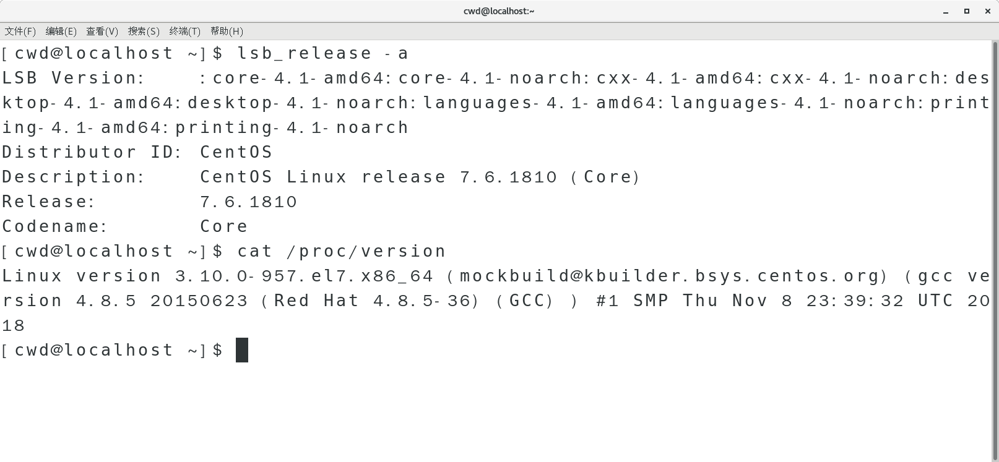

  答案：Centos 7.6;Linux version 3.10.0-957.el7.x86_64；

- 查看你的根目录下有哪几个子目录，每个子目录主要用来做什么用的？

  截图：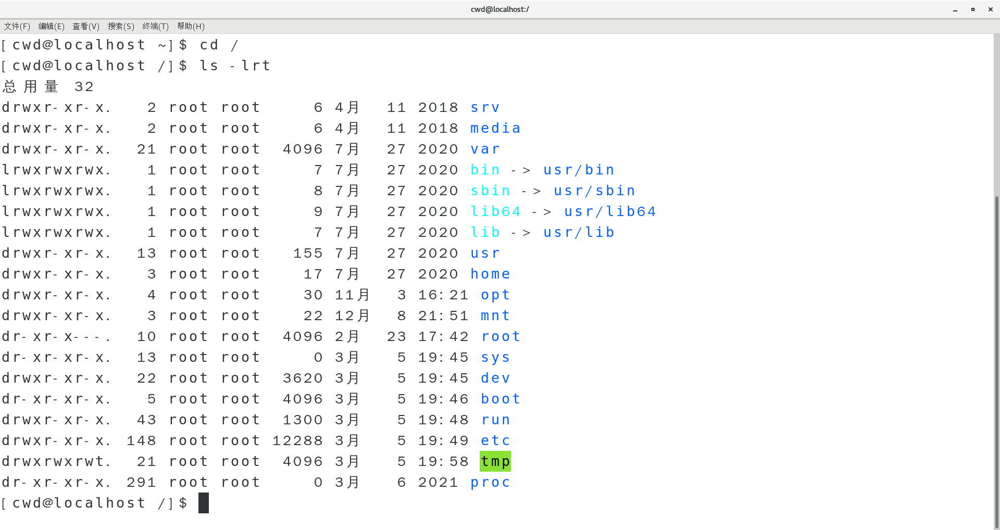

  答案：

  - /srv 主要用来存储本机或本服务器提供的服务或数据。
  - /media 是挂在多媒体设备的目录，如默认情况下的光盘、优盘、硬盘等设备都挂在在此目录
  - /opt 用来安装附加软件包，是用户级的程序目录
  - /run 是一个临时文件系统，存储系统启动以来的信息。当系统重启时，这个目录下的文件应该被删掉或清除。如果你的系统上有 /var/run 目录，应该让它指向 run。
  - /boot 这里存放的是启动 Linux 时使用的一些核心文件，包括一些连接文件以及镜像文件。
  - /sys sysfs 文件系统集成了下面 3 种文件系统的信息：针对进程信息的 proc 文件系统、针对设备的 devfs 文件系统以及针对伪终端的 devpts 文件系统。该文件系统是内核设备树的一个直观反映。当一个内核对象被创建的时候，对应的文件和目录也在内核对象子系统中被创建。
  - /bin 二进制可执行命令
  - /dev 设备特殊文件
  - /etc 系统管理和配置文件
  - /home 用户主目录的基点，比如用户 user 的主目录就是/home/user
  - /lib 标准程序设计库，又叫动态链接共享库，作用类似 windows 里的.dll 文件
  - /sbin 系统管理命令，这里存放的是系统管理员使用的管理程序
  - /tmp 保存在使用完毕后可随时销毁的缓存文件。
  - /root 系统管理员的主目录
  - /mnt 系统提供这个目录是让用户临时挂载其他的文件系统。
  - /proc 虚拟的目录，是系统内存的映射。可直接访问这个目录来获取系统信息。
  - /var 系统产生的不可自动销毁的缓存文件、日志记录
  - /usr 最庞大的目录，要用到的应用程序和文件几乎都在这个目录
  - /usr/bin 众多的应用程序
  - /usr/sbin 超级用户的一些管理程序
  - /usr/lib 常用的动态链接库和软件包的配置文件

- 查看自己的 ip 地址，并 ping 一下 baidu.com 看网络是否连通？

  命令：ip addr;ping baidu.com

  截图：
  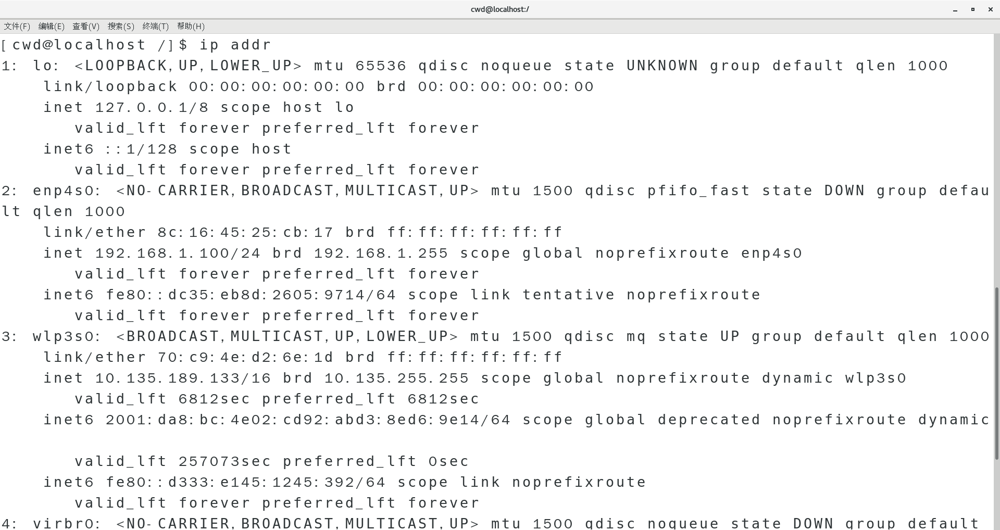
  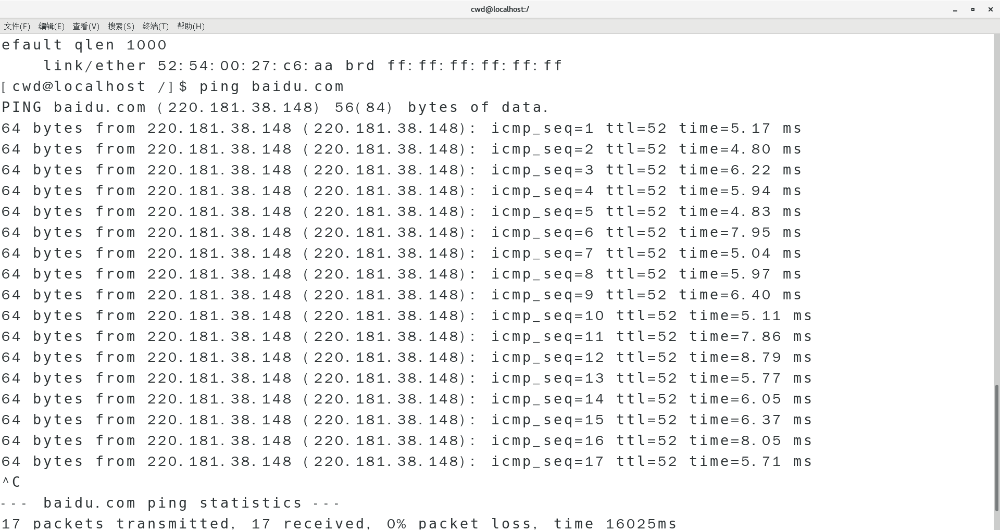

- 用软件安装命令下载 build-essential。

  命令： sudo apt-get install build-essential

  截图：

## 1. Linux 命令操作

- Linux 命令行操作，请用你学到的 Linux 命令，实现以下操作，给出每一步你的命令行截图。
  - 用 wget 从`https://github.com/BUAA-SE-2021/patpat/releases/download/v0.1.3/patpat-linux-amd64`下载你们的 Linux 版 OOP 课 Java 自助评测机 patpat
  - `https://github.com/BUAA-SE-2021/sp-labs/lab01/lab01.zip`处下载实验压缩包
  - 解压`lab01.zip`。
  - 进入`lab01`目录,进入子目录`etc`，打印当前路径并在当前路径下创建名为`a1`的目录，并在`a1`目录中创建名为`b1`的目录。
  - 进入`b1`目录中，创建两个文件`a.txt`，`b.txt`。
  - 退回子目录`etc`，删除目录`a1`。
  - 将`etc`目录下所有以`tmp`开头的文件移动到`lab01`目录下的`Download`目录下的`tmp`目录中。
  - 查看`tmp`目录下`a1005.cpp`的内容。
  - 查看`tmp`目录下`a1009.cpp`的前十行和后十行。
  - 将`tmp`目录下的所有文件打成一个`tar`包，并命名为`tmp.tar.gz`。
  - 返回`lab01`目录，列出当前目录下的文件大小。
  - 用命令找出空目录并将空目录删除。

命令：

```shell
# 不完整的部分自行补充，填写必要注释
wget -O patpat https://github.com/BUAA-SE-2021/patpat/releases/download/v0.1.3/patpat-linux-amd64 # 下载
wget -O lab01.zip https://github.com/BUAA-SE-2021/sp-labs/lab01/lab01.zip # 下载实验资料
unzip -n lab01.zip # 解压
cd lab01/etc # 进入目录
pwd # 打印当前路径
mkdir a1 # 创建目录`a1`
mkdir a1/b1 # 创建子目录`b1`
cd a1/b1 # 进入`b1`目录中
touch a.txt # 创建文件`a.txt`
touch b.txt # 创建文件`b.txt`
cd ../../ # 返回子目录`etc`
rm -rf a1 # 删除`a1`
cd c1
mv tmp* ../../Download/tmp # 移动
cd ../../Download/tmp
cat a1005.cpp # 查看
head -n 10 a1009.cpp # 查看前十行
tail -n 10 a1009.cpp # 后十行
tar cvf tmp.tar.gz * # 打包
cd ../../ # 返回`lab01`目录
du -sh # 列出当前目录下的文件大小
find -type d -empty # 用命令找出空目录
rmdir ./upload # 删除空目录
```

必要的实验截图(如查看前十行、查看文件大小的展示效果)

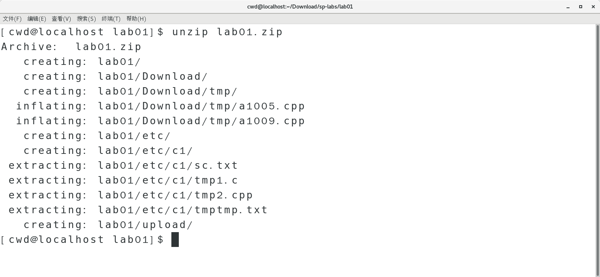
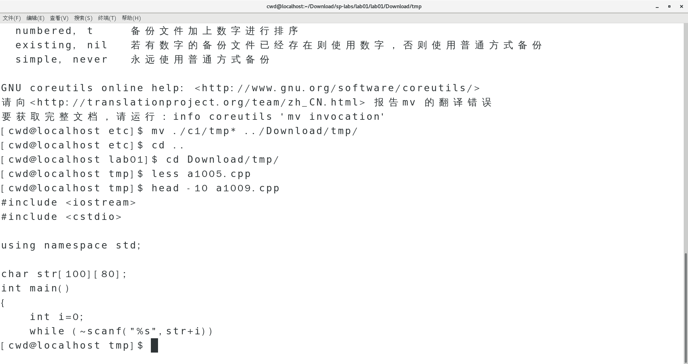
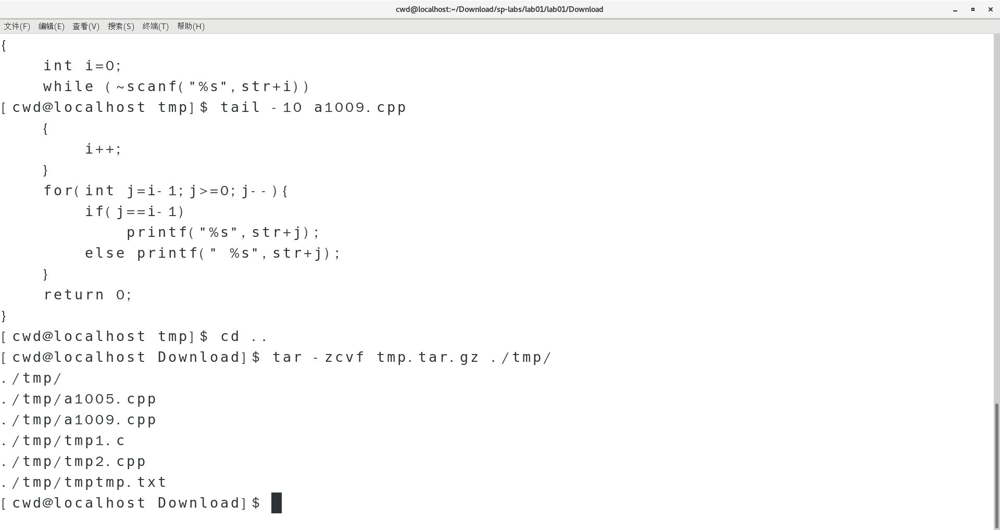
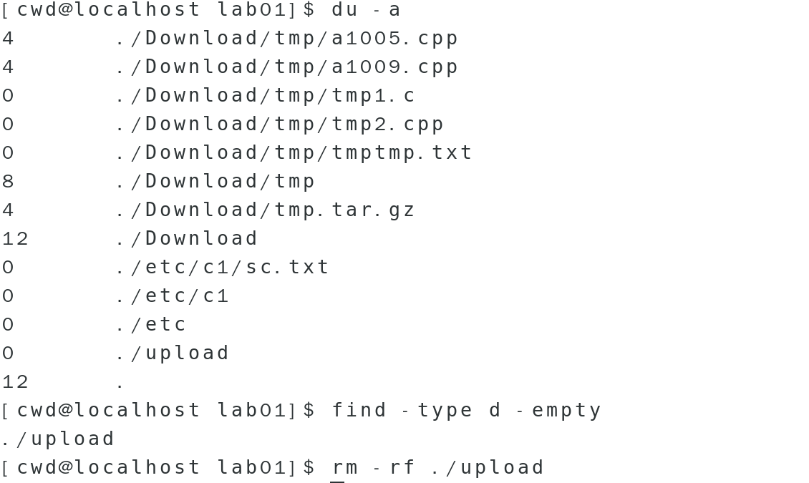

## 2. vi 模式

- vi 编辑器有哪几种模式？简述这几种模式间如何互相切换？

模式：

1. 命令模式
2. 底行模式
3. 插入模式

如何切换：用 vi 打开文件后默认进入命令模式。在命令模式输入操作符后进入插入模式，输入`esc`退出插入模式，返回命令模式；在命令模式下输入`:`或`/`进入底行模式，输入`esc`退出底行模式，返回命令模式。

## 3. vi 命令

> 写出以下⼀系列操作使⽤的**命令**（底⾏模式的命令加上 : 或 / ）：

### 3.1. ⽤ `vi` 在当前⽤户家⽬录下新建⽂件 `testfile` 并打开

```shell
vi testfile
```

### 3.2. 设置显示⾏号

```shell
:set number
```

### 3.3. 进⼊ `insert mode` ，输⼊ `3` ⾏⽂本

```plain
This is the first line.
This is the second line.
This is the third line.
```

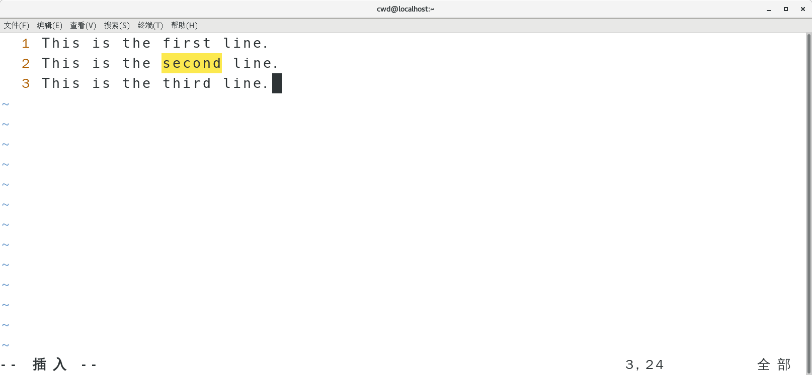

### 3.4. 返回到 `command mode` ，将光标移动到第 `2` ⾏，复制这⼀⾏

```shell
yy
```

### 3.5. 移动光标到⽂档最后⼀⾏，将复制内容粘贴到这⼀⾏后⾯

```shell
p
```

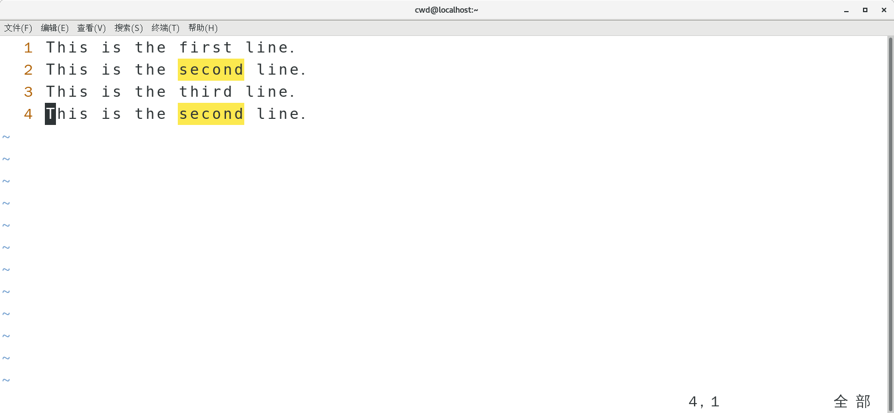

### 3.6. 移动光标到第⼀⾏，删除第⼀⾏

```shell
dd
```

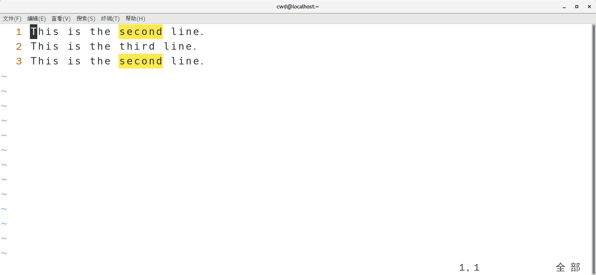

### 3.7. 从⽂档开头开始查找 `second` ，然后查找下⼀个

```shell
/second
n
```

### 3.8. 将全部 `second` 替换为 `fourth` ，替换过程不需要询问

```shell
:%s/second/fourth/g
```

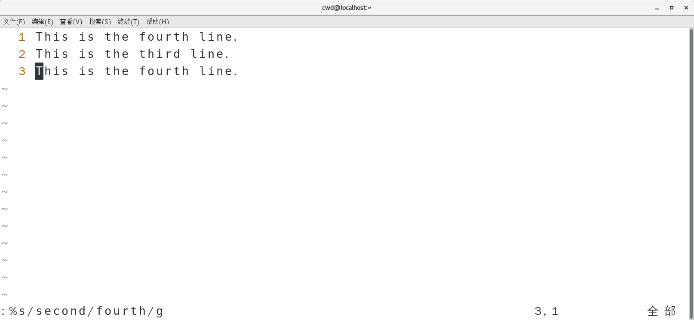

### 3.9. 取消显示⾏号

```shell
:set nonumber
```

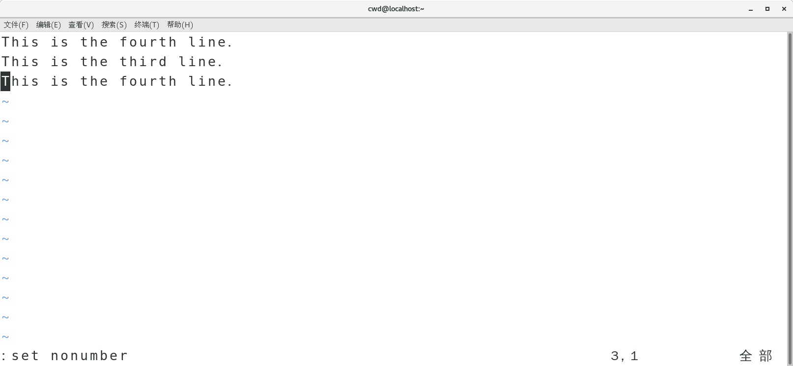

### 3.10. 保存修改并退出 `vi`

```shell
:wq!
```

### 3.11. 再次⽤ `vi` 打开 `testfile` ，另存为 `testfile2`

```shell
vi testfile
w testfile2
q!
```

## 4. POSIX

- 什么是 POSIX 标准？哪些操作系统支持 POSIX 标准？
  POSIX 表示可移植操作系统接口,定义了操作系统应该为应用程序提供的接口标准，是 IEEE 为要在各种 UNIX 操作系统上运行软件而定义的一系列 API 标准的总称。
  POSIX 并不局限于 Unix 系统，Microsoft windows NT 等也支持 POSIX 标准。

## 5. LSB

- 什么是 LSB 标准？分析它和 POSIX 标准的异同。
  LSB 是 Linux 标准化领域中事实上的标准，使各种软件可以很好地在兼容 LSB 标准的系统上运行。
  LSB 以 POSIX 和 SUS 标准为基础，还增加了对二进制可执行文件格式规范的定义，保证 Linux 上应用程序源码和二进制文件的兼容性。
