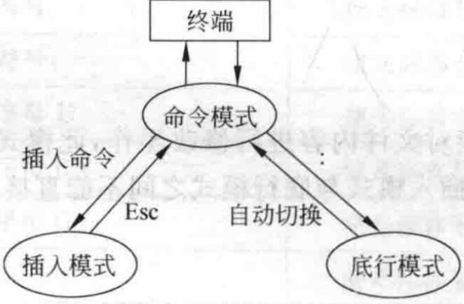

# Lab01: 基础命令 & vi 操作

[TOC]

## 1. 实验目的

通过使用 Linux 的基础命令和了解 vi 的基本操作，初识 Linux 系统及其基础概念，体会`UNIX`**一切皆*文件***的设计思想。通过学习 vi 编辑器并查看启动配置文件，体会`UNIX`**一切皆*文本***的设计理念。

提示：

- 结合书上例子和所给的 Linux 常用命令结合学习。

## 2. 实验内容

- Linux 基本命令
  - 绝对路径与相对路径的区别。
  - 一些常用的文件操作命令：包括对于文件的增删改查等常用操作。
  - 压缩解压命令：Linux 下有多种格式的压缩文件，掌握并知道他们的不同。
  - 权限操作命令：通过常用的权限操作命令，了解 Linux 系统下的不同权限与角色。
  - 网络管理命令：了解 Linux 下一些常用的网络管理命令，便于了解自己机器的网络状态。
  - 软件安装命令：掌握两种常见的软件安装命令。
  - 文件系统相关命令(选学)。
- vi 编辑器的使用
  - 学习三种使用模式下常用的操作及其相互切换方法。

## 3. 实验指南

### 3.1. 基本命令行操作

Linux 命令是对 Linux 系统进行管理的工具。虽然现在的操作系统大多搭载了图形用户界面(GUI)，但是在比如说服务器上，一般只有命令行用户界面(CLI)，所以掌握一些常用的命令行操作是十分实用且有必要的。

#### 3.1.1. 绝对路径与相对路径

Linux 操作系统中存在着两种路径：**绝对路径**和**相对路径**。我们在访问文件或文件夹的时候，其实都是通过路径来操作的。两种路径在实际操作中能起到同等的作用。

**绝对路径**永远都是相对于根文件夹的。它们的标志就是第一个字符永远都是“/”。

**相对路径**永远都是相对于我们所处的文件夹位置。它们的第一个字符没有“/”。

比如`/home/usr/test/h.c`，这就是绝对路径。如果当前处于`usr`文件夹下，那么相对路径就是`test/h.c`。

> `.`表示*当前路径*，`./test/h.c`和以上相对路径等价，`..`表示上一级目录，故也可写作 `../usr/test/h.c`

下面给出一些用的可能比较多的命令，要求**熟练掌握**，剩下一些命令可在日后学习开发过程中逐渐接触。

#### 3.1.2. 文件操作命令

- `ls` 查看目录和文件 如 `ls /home/usr/test`，就会列出该目录下文件。
- `pwd` 查看当前路径。
- `mkdir` 创建目录, `mkdir /home/usr` 在`/home`下创建`usr`目录。
- `cd` 切换目录，`cd /home/usr/test` 。`cd` 可以使用`.`和`..` ，即 `cd .` 和 `cd ..`。
- `touch` 本用于修改文件或者目录的时间属性，包括存取时间和更改时间，格式为`touch [-选项][-d<日期时间>][-r<参考文件或目录>] [-t<日期时间>][--help][--version][文件或目录…]`当文件不存在时，会**建立一个新的文件**，所以此命令一般也用于创建文件。
- `cp` 复制文件，命令格式 `cp [源路径] [目的路径]`。
- `mv` 移动文件，命令格式 `mv[源路径] [目的路径]`。
- `rm` 删除文件或目录，命令格式 `rm [目标路径]`，参数`-r`递归删除，即删除子文件夹，`-f`强制删除。
- `rmdir` 删除目录 `rmdir [路径]`。
- `cat` 查看文件内容， `cat /home/usr/test/h.c` , 输出文件中内容。
- `more` 分页查看。比如当`cat`输出大量文本内容时，很难看清，则可以通过`cat [文件] | more`来分页查看。`f/`空格显示下一页，回车显示下一行，`Q/q`退出。此处涉及到管道，有兴趣的可自行搜索。
- `less`是`more`的加强版，`less`在查看之前不会加载整个文件，并且可以随意浏览文件，不像`more`仅能向前移动，推荐使用！
- `which` 查找某一命令所在的路径,格式为`which 命令`，`whereis`命令与其类似，但是`whereis`还能展示命令帮助文档所在的路径。
- `find`，是最强大的搜索命令，格式为`find 搜索路径 [选项] 搜索关键字`,常用选项为`-name`，`-size`，`-user`，分别可以按文件名查找，根据文件大小查找，根据文件所有者查找。
- `locate` 功能与`find -name`相同，但是实现原理不同，`find`是遍历了搜索路径下的每个文件，而`locate`是搜索在`/var/lib/locatedb`里的一个数据库，相当于散列查找。要注意这个数据库并不是每秒都更新的，所以我们在使用`locate`命令之前，可先使用`updatedb`命令手动更新数据库。

**使用 pushd 和 popd 命令可以实现目录的快速切换**，具体的操作可参考[简书：Linux 中的 pushd 和 popd](https://www.jianshu.com/p/53cccae3c443)。

#### 3.1.3. 压缩与解压命令

Linux 下存在多种格式的压缩文件，其压缩和解压命令如下：

- `gzip/gunzip`

  格式为`gzip/gunzip [选项] 文件/压缩包包名`，可分别实现文件的压缩和压缩包的解压，要注意下面两点：

  1. `gzip`压缩后不保存源文件。
  2. 若同时压缩多个文件，则每个文件会被单独压缩。

- `zip/unzip`

  格式为`zip [-r] [压缩后文件名称] 文件或目录`与`unzip [选项] 压缩包包名`。`-r`代表压缩的是一个目录，压缩时会保留源文件。

#### 3.1.4. 网络管理命令

- `ifconfig` 查看当前网络配置，如`ip`等。
- `netstat` 查看当前网络状态。
- `ping` 检查网络是否连通。ping www.baidu.com 。

#### 3.1.5. 软件安装命令

在 Linux 下安装软件主要通过以下几种方式：

- 通过包管理工具，比如`Ubuntu`下的`apt`，`CentOS`的`yum`等，通过包管理工具安装程序非常方便，除了方便安装管理包，还能帮我们解决依赖问题。下面以`Ubuntu`下安装和卸载`mysql`为例。

  ```shell
  sudo apt-get install package 安装包
  sudo apt-get remove package 删除包
  sudo apt-get update 更新源
  ```

- 先把包通过某些命令下载到本地，再在本地运行安装程序。经常使用的是`wget`命令，格式为`wget [选项] [URL地址]`，可从指定的`URL`下载文件，还可以实现断点续传等功能，详细请看[wget 命令详解](https://www.cnblogs.com/sx66/p/11887022.html)。

### 3.2. vi 编辑器的使用

- 使用 vi 打开文件：

  ```shell
  $ vi file 打开已有文件file/创建名为file的新文件并打开
  $ vi 创建一个新文件并打开，文件名在保存时指定
  ```

vi 有三种模式：命令模式(command mode)，插入模式(insert mode)，底行模式(last line mode)。



- 命令模式(command mode)：使用 vi 打开文件后默认进入该模式，可以进行光标移动和文本的复制、粘贴、删除。

  |  级别  | 操作符 |             说明             |
  | :----: | :----: | :--------------------------: |
  | 字符级 | ← 或 h |     光标向左移动一个字符     |
  | 字符级 | → 或 l |     光标向右移动一个字符     |
  | 单词级 |   b    |   光标移动到本单词的首字符   |
  | 单词级 |   e    |   光标移动到本单词的尾字符   |
  | 单词级 |   w    | 光标移动到下一个单词的首字符 |
  |  行级  |   0    |    光标移动到当前行首字符    |
  |  行级  |   $    |    光标移动到当前行尾字符    |
  |  行级  | ↑ 或 k | 光标移动到上一行相同位置字符 |
  |  行级  | ↓ 或 j | 光标移动到下一行相同位置字符 |
  | 段落级 |   {    |     光标移动到段落首字符     |
  | 段落级 |   }    |     光标移动到段落尾字符     |
  | 屏幕级 |   H    |   光标移动到屏幕首行首字符   |
  | 屏幕级 |   L    |   光标移动到屏幕尾行首字符   |
  | 文档级 | **n**G | 光标移动到文档第 n 行首字符  |
  | 文档级 |   G    |   光标移动到文档尾行首字符   |

  |  级别  |  操作符  |                   说明                   |
  | :----: | :------: | :--------------------------------------: |
  | 字符级 | y← 或 yh |              复制前一个字符              |
  | 字符级 | y→ 或 yl |               复制当前字符               |
  | 单词级 |    yb    | 从单词首字符开始复制直到当前字符(不包括) |
  | 单词级 | ye 或 yw |  从当前字符开始复制直到单词尾字符(包括)  |
  |  行级  |    y0    |  从行首字符开始复制直到当前字符(不包括)  |
  |  行级  |    y$    |   从当前字符开始复制直到行尾字符(包括)   |
  |  行级  |    yy    |                复制当前行                |
  |  行级  | y↑ 或 yk |            复制上一行和当前行            |
  |  行级  | y↓ 或 yj |            复制当前行和下一行            |
  |  行级  | **n**yy  |      复制包括当前行在内的后面 n 行       |
  | 段落级 |    y{    | 从段落首字符开始复制直到当前字符(不包括) |
  | 段落级 |    y}    |  从当前字符开始复制直到段落尾字符(包括)  |
  | 屏幕级 |    yH    |    从屏幕首行开始复制直到当前行(包括)    |
  | 屏幕级 |    yL    |    从当前行开始复制直到屏幕尾行(包括)    |
  | 文档级 |    yG    |    从当前行开始复制直到文档尾行(包括)    |
  | 文档级 | y**n**G  |    从第 n 行开始复制直到当前行(包括)     |

  | 操作符 |                  说明                  |
  | :----: | :------------------------------------: |
  |   p    | 将复制的内容粘贴到当前字符的下一个位置 |

  | 操作符  |             说明              |
  | :-----: | :---------------------------: |
  |    x    |         删除当前字符          |
  |   dd    |          删除当前行           |
  | **n**dd | 删除包括当前行在内的后面 n 行 |

  | 操作符 |        说明        |
  | :----: | :----------------: |
  |   u    |      撤销命令      |
  |   .    | 重复执行上一次命令 |
  |   J    |    合并两行内容    |
  |   r    |  快速替换当前字符  |

- 插入模式(insert mode)：在命令模式下输入操作符(如`i`)进入插入模式，该模式下可以修改文件内容，与 Windows 记事本的操作类似。

  | 操作符 |               说明               |
  | :----: | :------------------------------: |
  |   a    |     光标后移一位进入编辑模式     |
  |   s    |     删除当前字符进入编辑模式     |
  |   o    |  当前行之下新起一行进入编辑模式  |
  |   A    | 光标移动到当前行末尾进入编辑模式 |
  |   I    | 光标移动到当前行行首进入编辑模式 |
  |   S    |      删除当前行进入编辑模式      |
  |   O    |  当前行之上新起一行进入编辑模式  |

  `Esc`从编辑模式返回命令模式。

- 底行模式(last line mode)：在命令模式下输入`:`或`/`进入底行模式，可以进行编辑器的设置、文本查找与替换、文件保存、退出编辑器。

  |  操作符   |   说明   |
  | :-------: | :------: |
  |  :set nu  | 设置行号 |
  | :set nonu | 取消行号 |

  底行模式下对 vi 编辑器的设置只对本次操作有效。

  vi 编辑器的用户配置信息存放在`~/.vimrc`文件中，可以通过修改该文件来进行长久有效的配置。

  ```shell
  $ vi ~/.vimrc
  ```

  |      设置       |      说明       |
  | :-------------: | :-------------: |
  |   set number    |    设置行号     |
  | set autoindent  |    自动对齐     |
  | set smartindent |    智能对齐     |
  |   set cindent   | C 语言格式对齐  |
  |  set showmatch  |    括号匹配     |
  |  set tabstop=4  | Tab 为 4 个空格 |
  |   set mouse=a   |    鼠标支持     |

  |           操作符           |                     说明                     |
  | :------------------------: | :------------------------------------------: |
  |           :**n**           |              光标移动到第 n 行               |
  |         /查找内容          |       查找指定内容，n 下一个，N 上一个       |
  |  :s/被替换内容/替换内容/   |            替换当前行的第一个目标            |
  |  :s/被替换内容/替换内容/g  |             替换当前行的全部目标             |
  | :%s/被替换内容/替换内容/g  |            替换整个文档的全部目标            |
  | :%s/被替换内容/替换内容/gc | 替换整个文档的全部目标，替换每个内容时都询问 |

  |    操作符     |                                    说明                                    |
  | :-----------: | :------------------------------------------------------------------------: |
  |  :w [文件名]  |                                  保存文件                                  |
  |      :q       |                                 退出编辑器                                 |
  | :wq [文件名]  |                            保存文件并退出编辑器                            |
  | :w! [文件名]  | 对于没有修改权限的用户强行保存对文件的修改，修改后的所有者和所属组发生变化 |
  |      :q!      |                         强行退出编辑器，不保存修改                         |
  | :wq! [文件名] |                          强行保存修改并退出编辑器                          |

  `Esc`清空底行或返回命令模式。

### 3.3. 扩展：Tmux 的使用

Tmux 是一个终端复用器（terminal multiplexer），它将会话与窗口的"解绑"，使二者彻底分离。非常有用，属于常用的开发工具。

详细请看：[Tmux 使用教程](http://www.ruanyifeng.com/blog/2019/10/tmux.html)

## 4. 实验准备

- 请安装一个合适的Linux系统，你安装的Linux发行版及版本号是什么？内核版本号是什么？
- 查看你的根目录下有哪几个子目录，每个子目录主要用来做什么用的？
- 查看自己的ip地址，并ping一下baidu.com看网络是否连通？
- 用软件安装命令下载build-essential。

## 5. 实验操作

- Linux 命令行操作，请用你学到的 Linux 命令，实现以下操作，给出每一步你的命令行截图。
  - 用wget从`https://github.com/BUAA-SE-Compiling/natrium/releases/download/v0.1.3/natrium-linux-amd64-musl`下载
  - 从`https://github.com/BUAA-SE-2021/sp-labs/lab01`处下载实验资料。
  - 解压实验资料里的`lab01.zip`。
  - 进入`lab01`目录,进入子目录`etc`，打印当前路径并在当前路径下创建名为`a1`的目录，并在`a1`目录中创建名为`b1`的目录。
  - 进入`b1`目录中，创建两个文件`a.txt`，`b.txt`。
  - 退回子目录`etc`，删除目录`a1`。
  - 将`etc`目录下所有以`tmp`开头的文件移动到`lab01`目录下的`Download`目录下的`tmp`目录中。
  - 查看`tmp`目录下`a1005.cpp`的内容。
  - 查看`tmp`目录下`a1009.cpp`的前十行和后十行。
  - 将`tmp`目录下的所有文件打成一个`tar`包，并命名为并命名为`tmp.tar.gz`。
  - 返回`lab01`目录，列出当前目录下的文件大小。
  - 用命令找出lab01下的空目录并将空目录删除。
- vi 编辑器有哪几种模式？简述这几种模式间如何互相切换？
- 写出以下一系列操作使用的**命令**（底行模式的命令加上`:`或`/`）：
  - 用 vi 在当前用户家目录下新建文件`testfile`并打开。
  - 设置显示行号。
  - 进入`insert mode`，输入 3 行文本"`This is the first line.`"，"`This is the second line.`"，"`This is the third line.`"。
  - 返回到`command mode`，将光标移动到第 2 行，复制这一行。
  - 移动光标到文档最后一行，将复制内容粘贴到这一行后面。
  - 移动光标到第一行，删除第一行。
  - 从文档开头开始查找`second`，然后查找下一个。
  - 将全部`second`替换为`fourth`，替换过程不需要询问。
  - 取消显示行号。
  - 保存修改并退出 vi。
  - 再次用 vi 打开`testfile`，另存为`testfile2`。
- 什么是 POSIX 标准？哪些操作系统支持 POSIX 标准？
- 什么是 LSB 标准？分析它和 POSIX 标准的异同。
