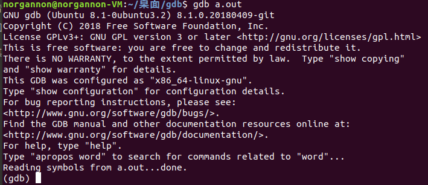
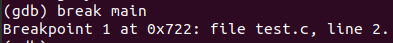
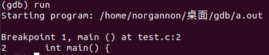
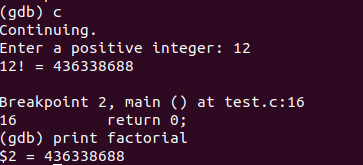
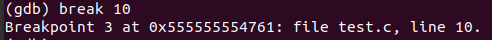

# Lab02 Assignment 参考答案

## 1. GCC

- GCC 将一个源程序转换为可执行文件经历了哪些主要步骤?

  源⽂件->预处理->编译->汇编->链接->可执⾏⽂件

- 请利用`test.c`用 GCC 命令将其将其转换为可执行程序的主要过程表示出来。 (命令和截图）

  ```sh
  gcc -E test.c -o test.i
  gcc -S test.i -o test.s
  gcc -c test.s -o test.o
  gcc test.o -o test
  ./test
  ```

## 2. 静态库

- 解压 lab02.zip
  
  ```sh
  unzip lab02.zip
  ```

- 使用 gcc 命令分别将`mytool1.c`和`mytool2.c` 编译成 .o 目标文件
  
  ```sh
  gcc -c mytool1.c -o mytool1.o
  gcc -c mytool2.c -o mytool2.o
  ```

- 说明上述两个命令完成了什么事？
  
  ```sh
  ar cr libmylib.a mytool2.o mytool1.o
  # 该命令将mytool2.o，mytool1.o这两个⽂件创建⽣成了libmylib.a这个静态库⽂件
  gcc -o main main.c -L. -lmylib
  # ⾸先将main.c编译⽣成了可执⾏⽂件main。在编译的时候链接静态库libmylib.a，表明main.c需要的函  数在该库中。
  ```

- 查看`main`文件大小，并记录
  
  ```sh
  ls -l
  # main此时⼤⼩为8800b
  ```

- 执行`./main`
  
  ```sh
  ./main
  ```

- 删除之前生成的静态库文件，重新执行`./main`命令，对比上一步骤得到的结果，你有什么发现？并解释原因。
  
  ```sh
  rm libmylib.a
  ./main
  ```

## 3.动态库

- 执行下面两个命令

  ```shell
  gcc -c -fPIC mytool2.c -o mytool2.o
  gcc -c -fPIC mytool1.c -o mytool1.o
  gcc -shared -o libmylib.so mytool2.o mytool1.o
  ```

  ```shell
  gcc -o main main.c -L. -lmylib
  ```

code #

- 查看`main`文件大小，并和之前的作比较，解释原因。
  code #

- 执行命令将当前目录添加到库搜索路径中

  ````shell
   export LD_LIBRARY_PATH=$LD_LIBRARY_PATH:;
  ```
  ````

  ```

  ```

code #

- 执行`./main`
  code #

- 删除之前生成的动态库文件，重新执行`./main`命令，对比上一步骤得到的结果，你有什么发现？
  code #

- 综合实验，你觉得静态库和动态库的区别和相同点是什么？谈谈他们的优缺点。
  code #

## 4. GDB

粘贴各步骤结果截图

（3）执行 gdb a.out 命令



（5）在 main 函数处设置断点



（6）输入 run 命令开始程序



（7）多次输入 next 命令使程序运行到第 13 行,使用 print 命令打印 num 的值


（8）继续调试至程序第 16 行,使用 print 命令打印 factorial 的值



（9）使用 run 命令再次调试程序


（10）在程序第 10 行加入断点



（11）使用 continue 命令使程序运行到断点处


（12）使用 next 命令


（13）使用 print 命令打印 i 和 factorial 的值


（14）使用 p factorial=1 命令改变 factorial 的值


（15）使用 info locals 查看所有局部变量值


（16）继续调试至程序结束


（17）说明源程序中存在的错误

​ factorial 没有初始化

## 5. Makefile

- 补全 makefile 文件

```shell
# 粘贴你的代码
SOURCE = $(wildcard ./src/*.c)  #获取所有的.c文件
#vpath %.c src
OBJ = $(patsubst %.c, %.o, $(SOURCE))   #将.c文件转为.o文件

INCLUDES = -I ./include   #头文件路径

CFLAGS = -Wall -c   #编译标志位

LIBS = -ldylib      #库文件名字
LIB_PATH = -L./lib  #库文件地址

TARGET = app
CC = gcc

$(TARGET): $(OBJ)
	@mkdir -p output/
	$(CC) $(OBJ) $(LIB_PATH) $(LIBS) -o output/$(TARGET)
	export LD_LIBRARY_PATH=./lib
%.o: %.c
	$(CC) $(CFLAGS) $(INCLUDES) $< -o $@
.PHONY: clean
clean:
	rm -rf $(OBJ) output/
print:
	echo $(OBJ)
```

## 6. 实验感想
