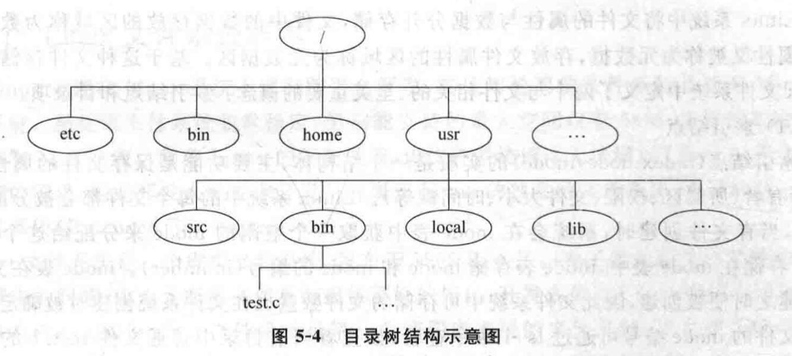
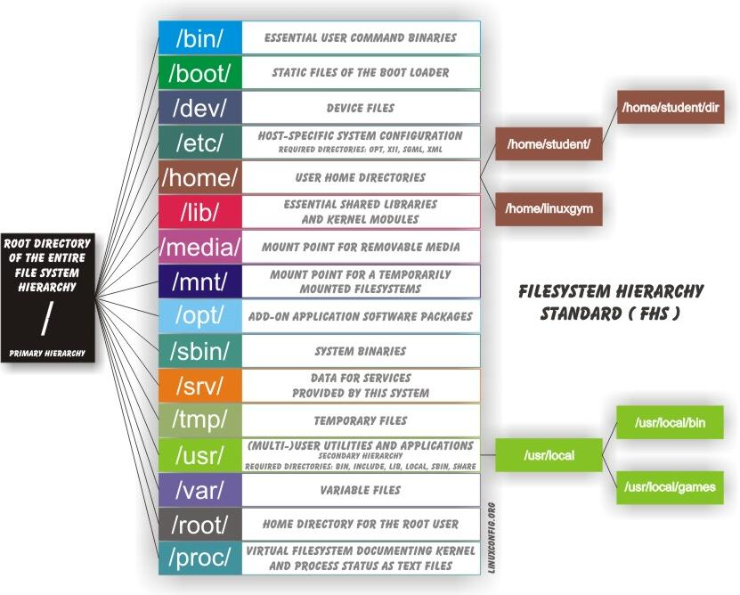
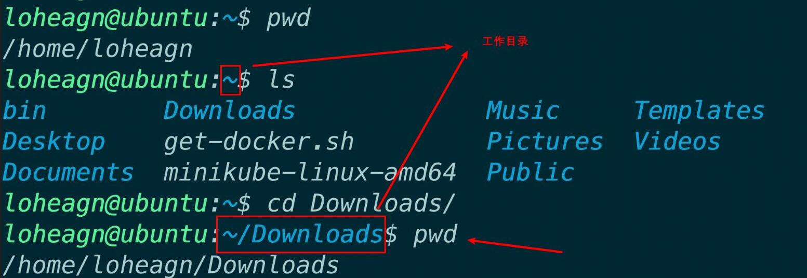
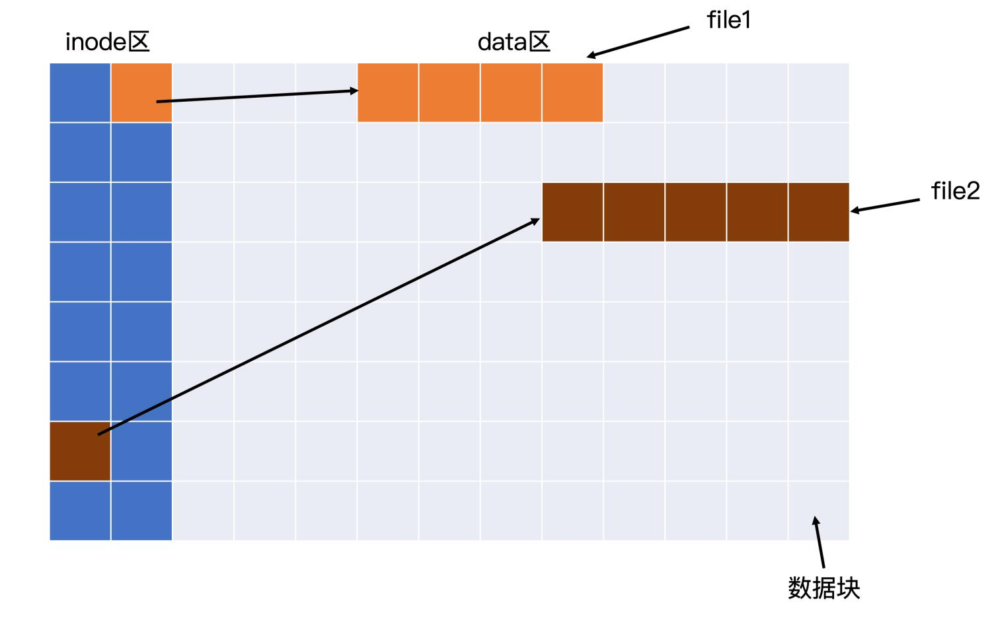
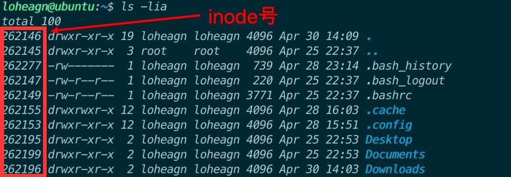
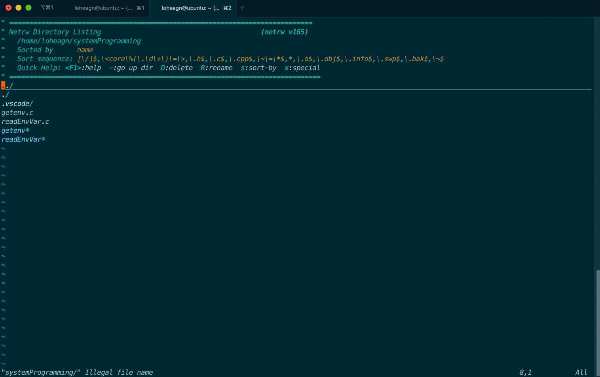
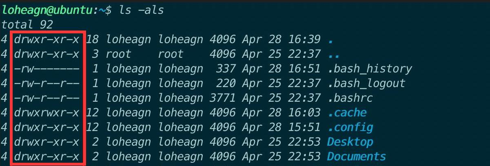
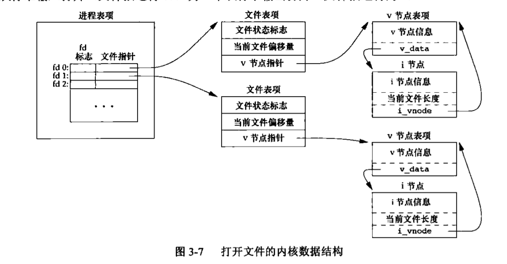
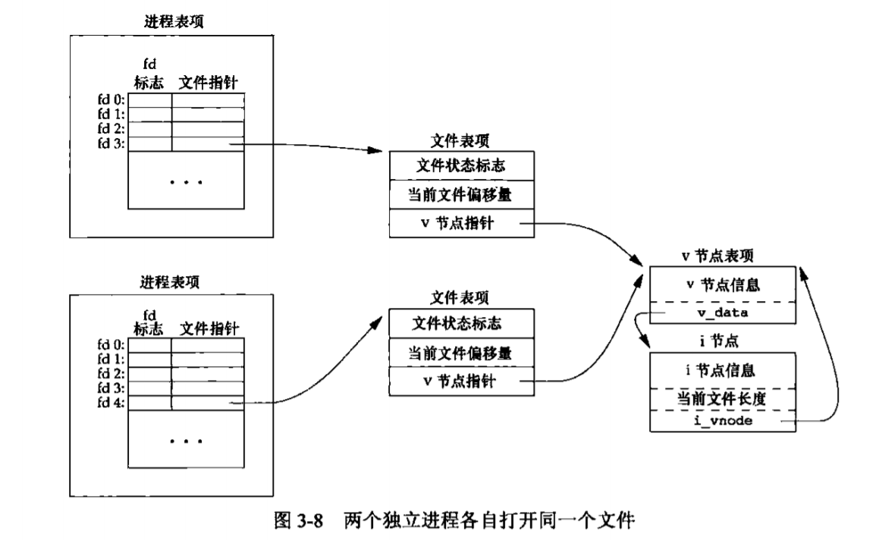

# Lab04: 文件 I/O 操作

[TOC]

## 1.实验目的

1. 在之前的基础上，进一步学习并掌握 Linux 系统中文件与文件系统的相关概念。

2. 学习并掌握与文件 IO 有关的 API。

3. 学习并掌握 Linux 系统中的 C 语言库函数、系统调用、和链接相关的知识。

## 2.实验内容

- 文件与文件系统
- Linux 的目录结构
- 工作目录、绝对路径与相对路径
- inode、硬链接与软链接
- 文件权限
- 文件描述符
- 常用的文件操作函数介绍

## 3.实验指南

### 3.1.文件I/O操作

#### 3.1.1.常用的文件操作函数介绍

**int create(const char \*filename, mode_t mode);**

create 函数的功是创建文件，如果创建成功会返回一个文件描述符，创建失败则返回-1。

**int open(const char \*pathname, int flags（，mode_t mode）)；**

open 函数的功能是打开创者创建一个文件。如果文件打开成功，open 函数会返回一个文件描述符，以后对该文件的所有操作就可以通过对这个文件描述符进行操作来实现。open 函数有两个形式，其中 pathname 是要打开的文件名。

**int close(int fd);**

关闭文件，成功调用则返回 0，否则返回-1。

**int read(int fd, const void \*buf,size_t length);**

函数 read 实现从文件描述符 fd 所指定的文件中读取 length 个字节到 buf 所指向的缓冲区中，返回值为实际读取的字节数。

**int write(int fd, const void \*buf,size_t length);**

函数 write 实现将 length 个字节从 buf 指向的缓冲区中写到文件描述符 fd 所指向的文件中，返回值为实际写入的字节数。

**int lseek(int fd, offset_t offset, int whence);**

lseek()将文件读写指针相对 whence 移动 offset 个字节。操作成功时，返回文件指针相对于文件头的位置。

**int fcntl(int fd, int cmd, ...); **

用来修改已经打开文件的属性的函数 。

**int stat(const char \*path,struct stat \*buf);**

用于获取文件的属性。参数 path 为文件路径。当函数调用成功之后，可以通过读取 buf 中的信息获取文件属性。

**int access(const char \*pathname,int mode);**

用于测试文件是否拥有某种权限。参数 pathname 为文件名，参数 mode 可取四个值，分别表示测试文件是否具有读、写、执行权限和文件是否存在。如果满足 mode 中值所代表的条件，则返回 0，否则返回-1。

**int chmod(const char \*path,mode_t mode);**

用于修改文件的访问权限。

**int truncate(const char \*path,off_t length);**

用于修改文件大小。

### 3.2.目录

#### 3.2.1.Linux 的目录结构

**FHS**(Filesystem Hierarchy Standard)：由 Linux Foundation 维护的 Linux 文件系统标准，定义了 Linux 系统中重要文件的组织方式。

不同于 Windows 的多树目录结构（每个磁盘分区都是一棵树），Linux 等 Unix 系统中只有一棵“文件树”。根目录`/`表示，是整棵文件树的“根”。

这里借用参考教材上的一张图：

)

按照这样的组织结构，`test.c`文件的在操作系统内的完整路径表示是`/usr/bin/test.c`.

在整棵目录树中，在用户没有进行过修改的情况下，每个目录有自己默认的用途，我们平常使用的软件也会去这些对应的目录下面放置自己生成的文件。比如，绝大多数软件都会在`/etc`目录下放置自己的配置文件。关于每个目录默认的用途，大家可以参考第一次试验的内容，几个重要的目录也放在了这里。**但要注意的是，大多数目录的使用没有严格的明文规定，你完全可以自定义每个目录的用途，比如，你完全可以把一个软件的配置文件放在一个乱七八糟的其他地方，只不过你在使用这个配置文件的时候要手动指定其路径；比如你完全可以把可执行文件放在`/bin`或`/usr/bin`之外的任何地方，只不过你要修改系统的环境变量`PATH`。**



- `/`：文件系统的根目录。
- `/bin/`：重要的用户命令二进制文件，是英语 binary 的缩写，表示“二进制文件”（我们知道可执行文件是二进制的）。包含了会被所有用户使用的可执行程序。
- `/etc/`：主机特定的系统配置，是 et cetera 的缩写，翻成英语就是 and so on，表示“等等”。包含系统的配置文件。至于为什么在`etc`下面存放配置文件， 按照原始的 UNIX 的说法(Linux 文件结构参考 UNIX 的教学实现 MINIX) ，这下面放的都是一堆零零碎碎的东西，就叫`etc`好了。
- `/home/`：用户家目录，英语 home 表示“家”。在这个目录中放置各个用户的私人文件，类似 Windows 中的`C:\Users\`。Linux 中的每个用户(除了`root`)都在 home 目录下有自己的一个私人目录。比如我的用户名是`sysp`，那么我的私人目录就是`/home/sysp`。**Linux 中，默认使用`~`来代表当前用户的家目录，比如，对于用户`sysa`来说，`~`就代表了`/home/sysp`。**
- `/lib/`：重要的共享库和内核模块，是英语 library 的缩写，表示“库”。包含被程序所调用的库文件，例如`.so`结尾的文件，在 Windows 下这样的库文件是以`.dll`结尾的。
- `/mnt/`：临时挂载的文件系统的挂载点，是英语 mount 的缩写，表示“挂载”。有点类似 media，但一般用于临时挂载一些装置。
- `/opt/`：附加应用程序软件包，是英语 optional application software package 的缩写，表示“可选的应用软件包”。用于安装多数第三方软件和插件。
- `/tmp/`：临时文件，是英语 temporary 的缩写，表示“临时的”。普通用户和程序存放临时文件的地方。**每次重启计算机都会清空该目录下的文件。**
- `/usr/`：多个用户的实用程序和应用程序，是英语 Unix Software Resource 的缩写，表示“Unix 操作系统软件资源”（也是个历史遗留的命名）。这个目录是最庞大的目录之一。有点类似 Windows 中的 C:\Windows 和 C:\Program Files 这两个文件夹的集合。在这里面安装了大部分用户要调用的程序。
- `/var/`：可变文件，是英语 variable 的缩写，表示“动态的，可变的”。通常包含程序的数据，比如一些 log（日志）文件，记录电脑中发生了什么事。
- `/root/`：root 用户的家目录，是英语“根”的意思。一般的用户的家目录位于/home 下。
- `/proc/`：以文本文件形式记录内核和进程状态的虚拟文件系统，这里的文件实际存在位置是内存中，并不是硬盘。

#### 3.2.2.工作目录、绝对路径与相对路径

一般来讲，用户执行的任何一个操作，都一定是在一个特定的“**工作目录**”中进行的。比如，在 bash 中，每一行的提示符中，主机名的冒号后面都会写明当前的工作路径，比如，当你一开始登录 Ubuntu 的时候，这里显示的是`~`，表示当前的工作目录是你的家目录，即`/home/${userName}`。使用`pwd`命令可以打印出当前的工作目录，依旧如下图所示。



**绝对路径**，从字面意义上很好理解，就是相对于根目录的路径，给定一个绝对路径，我们就能在系统中**唯一确定**一个资源。比如，上文中提到的`/usr/bin/test.c`，就是一个绝对路径。在同一个主机上，绝对路径绝对不会产生歧义。

**相对路径**，就是其所表示的资源相对于当前工作目录的路径。在 Linux 中我们会用`.`来表示当前路径，会用`..`来表示上一级路径。比如说，我当前的工作目录是`/home`，`test.c`相对于我来说的相对路径就是`../usr/local/test.c`。**请注意，相对路径仅仅对于当前的工作目录有意义**。

#### 3.2.3.Linux 目录结构查看命令

`tree`命令：将目录内容用树形表示。

- 安装(Ubuntu)：

  ```shell
  $ sudo apt install tree
  ```

- Usage(常用):

  ```shell
    # ------- Listing options -------
    -a            All files are listed. 列出所有文件
    -d            List directories only. 仅列出目录
    -l            Follow symbolic links like directories. 追踪符号链接
    -f            Print the full path prefix for each file. 打印完整路径
    -L level      Descend only level directories deep. 查看的目录深度
    -o filename   Output to file instead of stdout. 输出文件
    # -------- File options --------- 打印文件的其他信息
    -p            Print the protections for each file. 权限信息(rwx)
    -u            Displays file owner or UID number. 所有者
    -g            Displays file group owner or GID number. 所属组
    -s            Print the size in bytes of each file. 以字节为单位的文件大小
    -h            Print the size in a more human readable way. 可读性更强的文件大小
    -D            Print the date of last modification or (-c) status change. mtime/ctime
    --inodes      Print inode number of each file. inode编号
    --device      Print device ID number to which each file belongs. 设备号
    # ------- Sorting options ------- 排序标准
    -v            Sort files alphanumerically by version. 版本号中的字母和数字
    -t            Sort files by last modification time. mtime
    -c            Sort files by last status change time. ctime
    -U            Leave files unsorted. 不排序
    -r            Reverse the order of the sort. 逆序
    --dirsfirst   List directories before files (-U disables). 目录在前
    --sort X      Select sort: name,version,size,mtime,ctime. 选择排序标准
    # ------- Graphics options ------
    -i            Do not print indentation lines. 不缩进
    -n            Turn colorization off always (-C overrides). 关闭颜色显示
    -C            Turn colorization on always. 不同类型的文件用不同颜色表示
    # ---- Miscellaneous options ----
    --version     Print version and exit. 版本号
    --help        Print usage and this help message and exit. 帮助信息
  ```

#### 3.2.4.inode



上图**非常非常简略**的描述了 Linux 所使用的大多数文件系统对磁盘使用的抽象，仅供大家参考理解 inode 等概念。

关于 inode 的详细介绍，非常建议阅读下面的文章 (其中也包含了软硬链接的相关知识)。

[理解 inode——阮一峰的网络日志](https://www.ruanyifeng.com/blog/2011/12/inode.html)

#### 3.2.5.目录也是文件

目录在磁盘上的存储也是以文件的形式进行的。即，一个目录文件有自己的 inode 号，有自己的数据块，其中，这些数据块里存储的是本目录包含的文件信息。

比如，我们用`ls -li`命令查看文件的详细信息，同时列出每个文件的 inode 号：



我们还可以用`vim`来打开编辑一个目录文件，比如，编辑`systemProgramming`目录：



打开的界面中，上半部分是提示信息，提示了一些操作方法，不用管；下半部分是真正目录文件中的内容。大家可以尝试编辑这些内容。

#### 3.2.6与目录有关的系统调用

**DIR \*opendir(const char \*dirname);**

打开目录，返回一个指向DIR的指针,从而创建一个到目录的连接。

**struct dirent \*readdir(DIR *dir)；**

每次从DIR中读取目录项信息，该目录项信息保存在结构体dirent中。

**int closedir(DIR \* dir_ptr);**

关闭目录。

**void seekdir(DIR \*dir, off_t offset);**

确定下一次调用readdir读取目录时的位置。

**off_t telldir(DIR \*dir);**

返回当前所打开目录中下一次读取时的位置。

**void rewinddir(DIR \*dir);**

系统调用重置目录流的位置至起始位置。

**int mkdir(char\* pathname,mode_t mode); **

创建目录，成功创建目录时返回0，失败时返回-1并设置errno值。

**int rmdir(char\* pathname);**

删除目录，要求删除时目录为空，成功时返回0，失败时返回-1并设置errno值。

**int chdir(const char\* pathname,);**

切换进程自身工作目录，对其他进程工作目录没有影响。

**int rename(const char \*from,const char \*to);**

对目录或文件重新命名或移动到新的位置。

**char *getcwd(char *buf, size_t size);**

得到当前工作目录。

### 3.3.文件与目录的属性

#### 3.3.1.Linux 文件类型

Linux 文件类型：

- 普通文件：包括二进制文件、文本文件、可执行文件等。
- 目录文件：Linux 中目录以文件的形式存储。
- 设备文件：包括块设备文件和字符设备文件。
- 特殊文件：包括管道文件、套接字文件、符号链接文件。

#### 3.3.2.链接文件

Linux 中的链接文件类似于 Windows 中的快捷方式。

链接文件分为两种：硬链接文件和软链接文件。

（1）软链接文件

一个文件的软链接文件是一个新文件，被分配一个未被占用的`inode`，它指向的是原文件（被链接文件）的数据，也就是共享原文件的数据。

```shell
$ ln -s 源文件 目标文件
```

文件的大小代表文件数据块中存储的数据的大小，软链接文件中存储的数据就是源文件的路径名。

当访问软链接文件时，系统会从它的数据块中获取源文件的路径，再到这个路径中访问源文件。

（2）硬链接文件

硬链接文件与原文件共享`inode`，只是在硬链接文件的上级目录增加一项`dentry`，用来保存硬链接文件的文件名。因为`inode`是文件操作和表示的主结构体，因此，可以认为，硬件链接是一个文件，两个文件名。软件链接是两个文件，一份数据。

```shell
$ ln 源文件 目标文件
```

在创建硬链接文件时，文件的硬链接数会加`1`(可使用`ls -l`命令查看)；若执行删除操作，只有在硬链接数为`1`时该文件才会真正被删除，其他时候只是删除文件路径目录项中的记录并使文件硬链接数减`1`；创建软链接文件时不会增加被链接文件的链接次数。

Linux 中文件类型之一的符号链接文件只包含软链接文件，硬链接文件本质上是 Linux 中的普通文件。

`inode`与`dentry`：《Linux 编程基础》P100 5.1.3 。

链接文件的更多介绍：《Linux 编程基础》P113 5.3.2 。


#### 3.3.3.文件权限

大家在使用`ls -l`查看目录中文件的详细信息的时候，会看到这样一列的描述信息（红框框标出来的）：



这些描述信息一般有 10 个字符组成。

这个字段的第一个字符代表了对象的类型：

- `-` 代表是一个**普通**文件（**注意，在 Linux 中，“万物”皆为文件**）
- `d` 代表目录
- `l` 代表链接
- `c` 代表字符型设备
- `b` 代表块设备
- `n` 代表网络设备

比如，`-rw-rw-r--`的第一个字符是`-`，表示是一个文件；`drwxr-xr-x`的第一个字符是`d`，表示这是一个目录。

后 9 个字符分为 3 组，分别描述了文件的所有者、文件所属的用户组的其他用户、系统的其他用户对该文件的权限。


其中在这些描述用的字符中，`r`表示拥有读文件的权限，`w`表示拥有写文件的权限，`x`表示拥有执行文件的权限，这三个字符的位置是固定的，如果该位置上的字符为`-`，则表示该成员对该文件没有相应权限。

比如，上图中的意思就是，文件所有者对该文件有读、写、执行的权限，其他人只有读和执行的权限。

为了简便，**可以用数值来描述权限信息**，`r`对应的数值是`4`，`w`对应的数值是`2`，`x`对应的数值是`1`。每组权限信息是对这三个数值的简单相加，比如上图中的权限信息可以描述成`755`（**注意，这是一个八进制数**）。

可以使用`chmod`命令来修改一个文件的权限。下面举个例子。

首先新建一个文件：

```bash
touch test
```

它默认的权限是`rw-rw-r--`，即`664`， 可以用下面的命令修改权限，赋予每个用户对该文件的可执行权限：

```bash
chmod 775 test
```

当然，这里只是对`chmod`命令的简单介绍，可以在[这个链接](https://www.runoob.com/linux/linux-comm-chmod.html)中查看更多用法。


#### 3.3.4.文件描述符

文件描述符（file descriptor，简称 fd）是一个非负整数，存在于每一个进程的文件描述符表（也称打开文件描述符表）中。每个文件描述符对应一个打开文件，其范围是 0~一个进程最多可以打开的文件数量。

由于相同的文件可以被一个进程打开多次，所以不同的文件描述符可以指向同一个文件。每个文件描述符都是对于一个进程而言的，所以不同的进程的相同的文件描述符可能指向的是不同的文件。

文件描述符实际上是一个索引值，其作用是索引到该进程的文件描述符表中的对应表项。文件描述符表的表项里有一指针，指向在内核中的打开文件表的表项，该表项中存有打开文件的文件偏移量、文件相关目录项 dentry 等相关属性信息。






### 3.4标准文件I/O

#### 什么是标准I/O

文件I/O：文件I/O称之为不带缓存的IO（unbuffered I/O)。不带缓存指的是每个read，write都调用内核中的一个系统调用。也就是一般所说的低级I/O——操作系统提供的基本IO服务，与os绑定，特定于linux或unix平台。

标准I/O：标准I/O是ANSI C建立的一个标准I/O模型，是一个标准函数包和stdio.h头文件中的定义，具有一定的可移植性。标准I/O库处理很多细节。例如缓存分配，以优化长度执行I/O等。标准的I/O提供了三种类型的缓存。

（1）全缓存：当填满标准I/O缓存后才进行实际的I/O操作。 
（2）行缓存：当输入或输出中遇到新行符时，标准I/O库执行I/O操作。 
（3）不带缓存：stderr就是了。

#### 文件I/O和标准I/O的区别

​		文件I/O 又称为低级磁盘I/O，遵循POSIX相关标准。任何兼容POSIX标准的操作系统上都支持文件I/O。标准I/O被称为高级磁盘I/O，遵循ANSI C相关标准。只要开发环境中有标准I/O库，标准I/O就可以使用。（Linux 中使用的是GLIBC，它是标准C库的超集。不仅包含ANSI C中定义的函数，还包括POSIX标准中定义的函数。因此，Linux 下既可以使用标准I/O，也可以使用文件I/O）。
​		通过文件I/O读写文件时，每次操作都会执行相关系统调用。这样处理的好处是直接读写实际文件，坏处是频繁的系统调用会增加系统开销，标准I/O可以看成是在文件I/O的基础上封装了缓冲机制。先读写缓冲区，必要时再访问实际文件，从而减少了系统调用的次数。
​		文件I/O中用文件描述符表现一个打开的文件，可以访问不同类型的文件如普通文件、设备文件和管道文件等。而标准I/O中用FILE（流）表示一个打开的文件，通常只用来访问普通文件。

### 3.5处理系统调用中的错误

以书上例4-14为例（书中的该代码错误已在如下程序中修正）：

```c
#include<stdio.h>
#include<errno.h>
#include<unistd.h>
#include<sys/types.h>
#include<sys/stat.h>
#include<fcntl.h>
int main(void){
    int fd;
    fd = open("/home/zhyh/no_exist_file",O_WRONLY);
    if(fd < 0){
        perror("/home/zhyh/no_exist_file");
        return 0;
    }
}
```

通过 `perror()`，能将在 `open` 时发生的错误打印出来，以便于调试。

```shell
zhyh@ubuntu:~/splab$ gcc -o perrortest perrortest.c 
zhyh@ubuntu:~/splab$ ./perrortest 
/home/zhyh/no_exist_file: No such file or directory # 打印出了错误信息：没有这个文件/目录
```

## 4.实验内容

1. 简述文件描述符的作用并回答问题：文件描述符和文件是一对一对应的关系吗？

2. 写出文件 I/O 函数`open()`、`read()`、`write()`、`close()`都分别有哪些参数，每个参数的含义是什么？

3. 创建一个文件，内容为你的姓名的全拼（如张三同学，文件中的内容即为`zhangsan`)。编写 c 语言程序实现以下功能：首先打开该文件并输出文件的内容，之后将文件的内容修改为`May the force be with you, ${姓名全拼}!`，比如`May the force be with you, zhangsan!`，输出修改后文件的内容，最后关闭文件。要求使用到`open()` `read()` `write()` `close()`函数。请详细叙述你的操作过程以及操作过程的截图，并给出你所编写的 C 程序的代码。

4. 针对书中例4-3按照顺序执行下列命令：

   ```
   ./writelock&
   ls-l>book.dat
   ```

   查看book.dat数据是否发生变化，解释原因。

   输入书中P110程序write.c,按下列方式执行程序

   ```
   ./writelock &
   ./write
   ./write
   ./write
   ```
book.dat文件数据的变化情况是什么？给出原因，给出必要的截图。
   
5. 创建文件`~/srcfile`，使用 `ln` 命令创建 `srcfile` 的软链接文件 `~/softlink` ，给出使用的命令；使用 `ls -l` 查看 `~` ，观察 `softlink` 的文件大小，并解释为什么；使用 `ln` 命令创建 `srcfile`的硬链接文件 `~/hardlink` ，给出使用的命令；使用 `ls -l` 观察 `srcfile` 硬链接数的变化。

6. 创建一个文件，内容为你的姓名的全拼（如张三同学，文件中的内容即为`zhangsan`)。编写 c 语言程序实现以下功能：首先打开该文件并输出文件的内容，之后将文件的内容修改为`May the force be with you, ${姓名全拼}!`，比如`May the force be with you, zhangsan!`，输出修改后文件的内容，最后关闭文件。**要求使用到`fopen()` `fread()` `fwrite()` `fclose()`函数**。请详细叙述你的操作过程以及操作过程的截图，并给出你所编写的 C 程序的代码。

   

