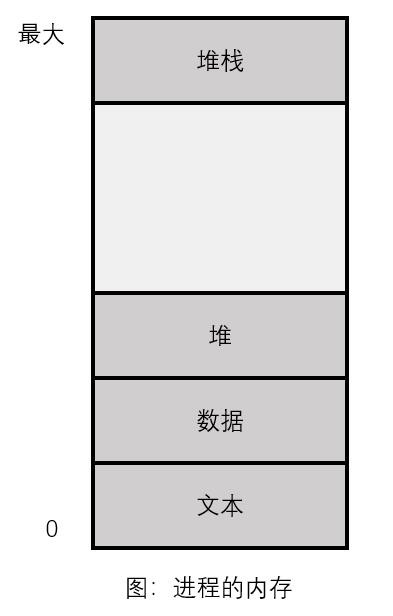
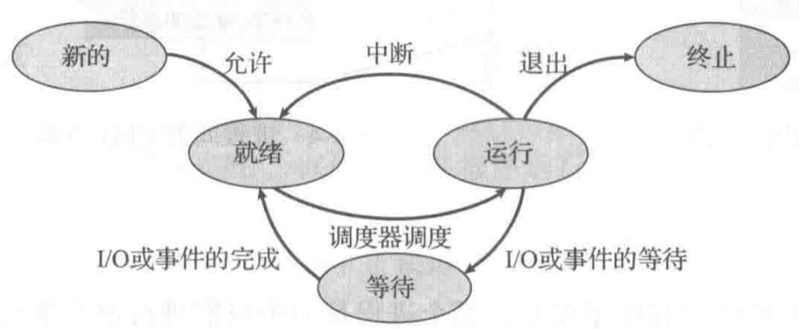
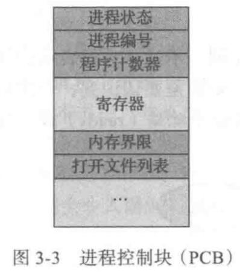
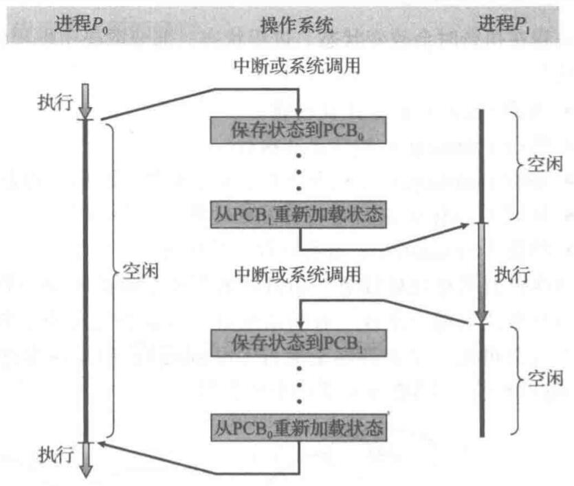
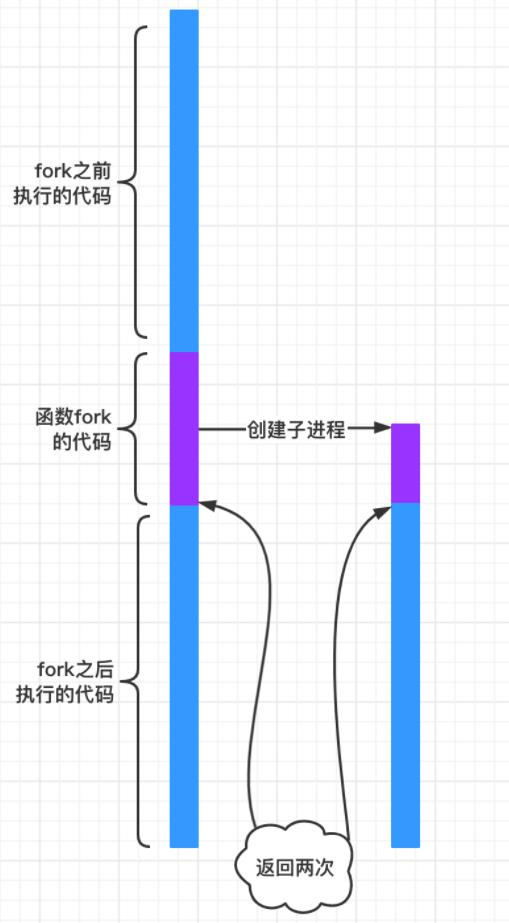

# Lab05: Linux 进程管理

[TOC]

## 1. 实验指南

### 1.1. 进程

进程的英文是`process`，意为“做事情的过程”，操作系统中的进程就可以理解为“**操作系统执行一个程序的过程**”。

程序在编译后以二进制方式存在于外存上，执行的时候被操作系统载入内存。以 Linux 系统上的 C 语言编译出来的程序为例，载入的过程简单来说就是把编译完成的 ELF 文件的几个段的内容读取到内存指定位置，然后初始化寄存器的内容，将指令寄存器（比如`cs:ip`）指向程序入口，再初始化一些进程相关内容就完成了。在某一次时钟中断发生的时候，进程主动陷入内核态，进行进程切换的系统调用，CPU 将切换到另一个进程工作（关于具体的进程切换的细节是大家下学期学习操作系统的重点）。**总而言之，整个计算机从开机到关机，就是一个不断创建、切换、终止进程的过程。**

#### 1.1.1. 进程概念的用途

- 早期的计算机一次只能执行一个程序，这种程序完全控制系统，并且访问所有系统资源。
- 相比之下，现代计算机系统允许“同时”加载多个应用程序到内存，以便并发（轮流）执行。
- 这种改进要求：对各种程序提供更严的控制和更好的划分。这些需求导致了**进程**概念的诞生。
- 进程是现代分时操作系统的工作单元，是操作系统向运行中的程序进行资源分配的单位。
- 进程包括：程序代码(文本)，当前活动(程序计数器，寄存器的值)，堆栈，数据端，堆。

  

- 程序与进程：程序是被动(`passive`)实体，如存储在磁盘上的可执行文件；进程是活动(`active`)实体，具有一个程序计数器用于表示下个执行命令和一组相关资源。
- 当一个可执行文件被加载到内存时，这个程序就成为进程。
- 两个进程可以与同一程序相关联，但当作两个单独的执行序列，虽然文本段相同，但是数据、堆、堆栈不同。

#### 1.1.2. 进程状态（选读）

- 进程在执行时会改变状态，每个进程可能处于以下状态：
  - 新的(`new`)：进程正在创建。
  - 运行(`running`)：指令正在执行。
  - 等待(`waiting`)：进程等待发生某个事件（如`I/O`完成或收到信号）。
  - 就绪(`ready`)：进程等待分配处理器。
  - 终止(`terminated`)：进程已经完成执行。
- 一次只有一个进程可在一个处理器上**运行**(`running`)
- 可以有多个进程处于**就绪**(`ready`)或**等待**(`waiting`)状态
- 进程状态图：

  

#### 1.1.3. PCB（选读）

对于多任务处理系统，一般来讲，CPU 核心数远低于当前系统中同时存在的进程数，因此，某一时刻，大概率总有一些进程处于非运行时状态。但这些进程在未来的一些时刻又将会被调度执行，恢复到之前该进程被终止时候的状态。因此，有必要把一个进程被终止时的信息记录下来。这些信息被称为进程控制块 PCB（Process Control Block），主要包括进程被终止时各个寄存器的使用情况、父进程 ID、进程组 ID 等。操作系统可以通过进程的 ID，找到该进程的 PCB。

PCB 可能包含的信息有：

- 进程状态(`process state`)：包括上面提到的五种状态。
- 程序计数器(`program counter`)：表示进程将要执行的下个指令的地址。
- CPU 寄存器(`CPU register`)：根据计算机体系结构的不同，寄存器的类型和数量也会不同，通常包括累加器、索引寄存器、堆栈指针、通用寄存器和其他条件码寄存器。在发生中断时，这些状态信息与程序计数器一起保存，以便进程以后能正确地继续执行。
- CPU 调度信息(`CPU-scheduling information`)：包括进程优先级、调度队列的指针和其他调度参数。
- 内存管理信息(`memory-management information`)：可能包括基地址和界限寄存器的值、页表或段表。
- 记账信息(`accounting information`)：包括 CPU 时间、实际使用时间、时间期限、记账数据、作业或进程数量等。
- I/O 状态信息(`I/O status information`)：包括分配给进程的`I/O`设备列表、打开文件列表等。

  

- 进程间的 CPU 切换：

  

### 1.2. 进程控制

#### 1.2.1. 进程标识

- 每个进程都有一个非负整型表示的唯一进程 ID——`pid`。
- `pid`是可复用的，当一个进程终止后，其进程 ID 就成为复用的候选者。
- 除了`pid`，每个进程还有一些其他标识符，例如：`ppid`，`uid`，`euid`，`gid`，`egid`。

#### 1.2.2. 使用 `fork` 创建新进程

fork 的作用是创建一个子进程，共享父进程所有内容，并且这个子进程会接着 fork 下面的代码继续执行。关于 fork 的用法之类的不在赘述，下面探讨下 fork 的原理。fork 吹嘘的最神奇的地方莫过于执行一次，返回两次，但这句话噱头成分更大一些。在一个进程中，一次函数调用肯定只能返回一次，之所以 fork 会返回两次，是因为在 fork 执行的过程中，会根据本进程克隆出一个新的子进程，在子进程中依旧会执行 fork 剩余的代码，也自然会从 fork 中返回。这样，在父进程返回一次，在子进程中返回一次，自然就是所谓的“返回两次”。



```c
#include <unistd.h>

pid_t fork();

// 返回值：子进程返回0，父进程返回子进程ID；若出错，返回-1
```

- 一个现有的进程可以调用`fork`函数创建一个新进程。
- `fork`有以下两种用法：
  - 一个父进程希望复制自己，使父进程和子进程同时执行不同的代码段。
  - 一个进程要执行一个不同的程序。在这种情况下，子进程从`fork`返回后立即调用`exec`。

#### 1.2.3. 使用 exec 函数族执行新的程序

`exec()`函数族包括以下七个函数：

```c
#include <unistd.h>

int execl(const char *pathname, const char *arg0, ... /* (char *)0 */);

int execv(const char *pathname, char *const argv[]);

int execle(const char *pathname, const char *arg0, ...
          /* (char *)0, char *const envp[] */);

int execve(const char *pathname, char *const argv[], char *const envp[]);

int execlp(const char *filename, const char *arg0, ... /* (char *)0 */);

int execvp(const char *filename, char *const argv[]);

int fexecve(int fd, char *const argv[], char *const envp[]); // 第一个参数使用的是打开的文件描述符，而非文件路径名

// 7个函数返回值：若出错，返回-1；若成功，不返回
```

exec 函数族的作用是根据指定的文件名找到可执行文件，并用它来取代调用进程的内容换句话说，就是在调用进程内部执行一个可执行文件。这里的可执行文件既可以是二进制文件，也可以是任何 Linux 下可执行的脚本文件。与一般情况不同，exec 函数族的函数执行成功后不会返回，因为调用进程的实体，包括代码段，数据段和堆栈等都已经被新的内容取代，只留下进程 ID 等一些表面上的信息仍保持原样。只有调用失败了，它们才会返回一个 -1，从原程序的调用点接着往下执行。

这几个函数的用法大体上是一致的，只是参数格式有所不同。

- " l " 代表 list 即列表，对应可变参数`argv` 以列表的形式出现
- " v " 代表 vector 即矢量数组，对应可变参数`argv`以数组的形式出现
- " e " 代表 environment ，对应 `envp`数组，是指给可执行文件指定环境变量。在全部 7 个函数中，只有`execle`、`execve`和`fexecve`使用了`char *envp[]`传递环境变量，其它的 4 个函数都没有这个参数，这并不意味着它们不传递环境变量，这 4 个函数将把默认的环境变量不做任何修改地传给被执行的应用程序。而它们用指定的环境变量去替代默认的那些。
- " p " 代表 环境变量 PATH ,字母 p 是指在环境变量 PATH 的目录里去查找要执行的可执行文件。2 个以 p 结尾的函数`execlp`和`execvp`，看起来，和`execl`与`execv`的差别很小，事实也如此，它们的区别从第一个参数名可以看出：除 `execlp`和`execvp`之外的 4 个函数都要求，它们的第 1 个参数 path 必须是一个完整的路径，如"/bin/ls"；而`execlp`和`execvp` 的第 1 个参数 file 可以仅仅只是一个文件名，如"ls"，这两个函数可以自动到环境变量 PATH 指定的目录里去查找。

**注意：**

- 当进程调用一种`exec`函数时，该进程执行的程序完全替换为新程序，而新程序从其`main`函数开始执行。
- 调用`exec`并不创建新进程，前后的进程 ID 并未改变，`exec`只是用磁盘上的一个新程序替换了当前进程的正文段、数据段、堆段和栈段。
- 在很多 UNIX 实现中，**这`7`个函数只有`execve`是内核的系统调用**，另外`6`个只是库函数，它们最终都要调用该系统调用。

#### 1.2.4. 使用 exit 处理进程终止

```c
#include <stdlib.h>

void exit(int status);

void _Exit(int status);

#include <unistd.h>

void _exit(int status);
```

- 有`8`种方式使进程终止，其中`5`种为正常终止。
- `3`个函数用于正常终止一个程序：`_exit`和`_Exit`立即进入内核，`exit`则先执行一些清理处理，然后返回内核。

#### 1.2.5. 使用 `wait/waitpid` 等待进程终止

```c
#include <sys/wait.h>

pid_t wait(int *statloc);

pid_t waitpid(pid_t pid, int *statloc, int options);

// 两个函数返回值：若成功，返回进程ID；若出错，返回0或-1
```

更多信息请阅读`manual`或《APUE》的相关章节。

### 1.3. 进程间通信

这部分内容介绍的是操作系统内部的进程间的通信（Inter-Process Communication，IPC），主要包含管道通信、SystemV IPC（消息队列、信号量、共享内存等），不包含 socket 连接等系统之间的进程间的通信。

本次实验内容只涉及管道和重定向内容。

#### 1.3.1. 再谈重定向

在之前的思考题中，我们出现过 `dup` 函数，复制一个现存的文件描述符。事实上，文件描述符便与重定向密切关联。我们可以从 man 手册中了解 `dup`、`dup2` 和 `dup3()` 这三个函数。[dup(2) — Linux manual page](https://man7.org/linux/man-pages/man2/dup2.2.html)

重定向产生的原因就是文件描述符在分配时趋向于数值小的，而在用户层，stdout 这个文件指针指向的文件已经封装了，并且它的 fd 就是 1，这是不能修改的，所以我们一上来关闭了 1 号文件，然后新创建了一个文件它的文件描述符就会分配为被 1，同时此时写入时，像 `printf` 这类函数默认使用的输出流就是 stdout，但是我们知道它的 1 指向的已经是我们新生成的那个文件了，所以这就重定向的本质。

#### 1.3.2. 再谈管道

管道是最基本的进程通信机制，可以想象成一个管道，两端分别连着 2 个进程，一个进程往里面写，一个进程从里面读。如果读或写管道的时候没有内容可供读或写，进程将被阻塞，直到有内容可供读写为止。

管道分为匿名管道和命名管道。 匿名管道创建后本质上是 2 个文件描述符，父子进程分别持有就能够使用管道，需要注意的是不能够共用匿名管道，也就是除了使用的进程，其他进程需要关闭文件描述符，保证管道 的 2 个描述符分别同时只有 1 个进程持有。

命名管道是根据路径来使用管道，故能够在任意进程间通信。（仅要求掌握匿名管道，命名管道作为了解）

## 2. 实验习题

- 请写这样一个程序（不是函数）：传入三个参数，传入该程序的第一个参数用以判断该程序进行有理数算术加运算还是减运算（0 表示将要进行加运算，1 表示将要进行减运算），第二个第三个参数分别是加（减）运算的第一第二个元素。（提示：`main(int argc, char*argc[])`，可获取命令行参数）。
- 请写这样一个程序：使用创建子进程的方式调用上一个程序，进行加运算和减运算（请学习`fork`和`exec`函数的使用）。
- 守护进程有哪些特点，创建一个守护进程需要哪些步骤，每一步的意义是什么？（如果没有这一步可能有什么问题）
- 僵尸进程有什么危害？编写一个会产生僵尸进程的程序并运行，在终端查看当前进程。然后利用终端杀死该进程。
- 编写一个 C 程序：使得调用 `printf()` 时，输出直接重定向至 `log.txt`。
- 有以下一段代码：

  ```c
  int fd1, fd2, fd3, fd4;
  fd1 = open("a.txt", O_RDONLY);
  fd2 = open("b.txt", O_WRONLY);
  fd3 = dup(fd1);
  fd4 = dup2(fd2, 0);
  ```

  请问，最后的 fd1, fd2, fd3, fd4 的值为多少？并解释原因。

- 编写 C 语言程序实现如下功能：创建父子进程，父子进程之间通过管道进行通信，父进程向子进程发送字符串，子进程接收到该字符串后，将该字符串的最后 5 个字符发送给父进程。
