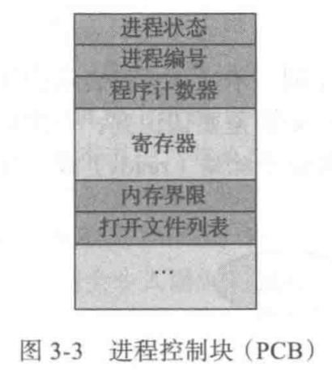

# Lab05: Linux 进程管理

## 实验指南

### 进程

进程，粗略的讲，是用来表示运行的程序。注意是“表示”，类比于教务系统中用“学籍”表示一个学生。有兴趣可参考：《操作系统概念》P72 3.1 进程概念，《APUE》P158 7.3 进程终止，第 8 章 进程控制。

#### 进程概念的用途

- 早期的计算机一次只能执行一个程序，这种程序完全控制系统，并且访问所有系统资源。
- 相比之下，现代计算机系统允许“同时”加载多个应用程序到内存，以便并发（轮流）执行。
- 这种改进要求：对各种程序提供更严的控制和更好的划分。这些需求导致了**进程**概念的诞生。
- 进程是现代分时操作系统的工作单元，是操作系统向运行中的程序进行资源分配的单位。
- 进程包括：程序代码(文本)，当前活动(程序计数器，寄存器的值)，堆栈，数据端，堆。

  

- 程序与进程：程序是被动(`passive`)实体，如存储在磁盘上的可执行文件；进程是活动(`active`)实体，具有一个程序计数器用于表示下个执行命令和一组相关资源。
- 当一个可执行文件被加载到内存时，这个程序就成为进程。
- 两个进程可以与同一程序相关联，但当作两个单独的执行序列，虽然文本段相同，但是数据、堆、堆栈不同。

#### 进程状态

- 进程在执行时会改变状态，每个进程可能处于以下状态：
  - 新的(`new`)：进程正在创建。
  - 运行(`running`)：指令正在执行。
  - 等待(`waiting`)：进程等待发生某个事件（如`I/O`完成或收到信号）。
  - 就绪(`ready`)：进程等待分配处理器。
  - 终止(`terminated`)：进程已经完成执行。
- 一次只有一个进程可在一个处理器上**运行**(`running`)
- 可以有多个进程处于**就绪**(`ready`)或**等待**(`waiting`)状态
- 进程状态图：

  

#### PCB

- 操作系统采用**进程控制块**(`Process Control Block, PCB`)来表示进程。
- PCB 可能包含的信息有：
  - 进程状态(`process state`)：包括上面提到的五种状态。
  - 程序计数器(`program counter`)：表示进程将要执行的下个指令的地址。
  - CPU 寄存器(`CPU register`)：根据计算机体系结构的不同，寄存器的类型和数量也会不同，通常包括累加器、索引寄存器、堆栈指针、通用寄存器和其他条件码寄存器。在发生中断时，这些状态信息与程序计数器一起保存，以便进程以后能正确地继续执行。
  - CPU 调度信息(`CPU-scheduling information`)：包括进程优先级、调度队列的指针和其他调度参数。
  - 内存管理信息(`memory-management information`)：可能包括基地址和界限寄存器的值、页表或段表。
  - 记账信息(`accounting information`)：包括 CPU 时间、实际使用时间、时间期限、记账数据、作业或进程数量等。
  - I/O 状态信息(`I/O status information`)：包括分配给进程的`I/O`设备列表、打开文件列表等。

  

- 进程间的 CPU 切换：

  

#### 进程控制

##### 进程标识

- 每个进程都有一个非负整型表示的唯一进程 ID——`pid`。
- `pid`是可复用的，当一个进程终止后，其进程 ID 就成为复用的候选者。
- 除了`pid`，每个进程还有一些其他标识符，例如：`ppid`，`uid`，`euid`，`gid`，`egid`。

##### 使用 `fork` 创建新进程

```c
#include <unistd.h>

pid_t fork();

// 返回值：子进程返回0，父进程返回子进程ID；若出错，返回-1
```

- 一个现有的进程可以调用`fork`函数创建一个新进程。
- `fork`有以下两种用法：
  - 一个父进程希望复制自己，使父进程和子进程同时执行不同的代码段。
  - 一个进程要执行一个不同的程序。在这种情况下，子进程从`fork`返回后立即调用`exec`。

##### 使用 exec 函数族执行新的程序

```c
#include <unistd.h>

int execl(const char *pathname, const char *arg0, ... /* (char *)0 */);

int execv(const char *pathname, char *const argv[]);

int execle(const char *pathname, const char *arg0, ...
          /* (char *)0, char *const envp[] */);

int execve(const char *pathname, char *const argv[], char *const envp[]);

int execlp(const char *filename, const char *arg0, ... /* (char *)0 */);

int execvp(const char *filename, char *const argv[]);

int fexecve(int fd, char *const argv[], char *const envp[]);

// 7个函数返回值：若出错，返回-1；若成功，不返回
```

- 当进程调用一种`exec`函数时，该进程执行的程序完全替换为新程序，而新程序从其`main`函数开始执行。
- 调用`exec`并不创建新进程，前后的进程 ID 并未改变，`exec`只是用磁盘上的一个新程序替换了当前进程的正文段、数据段、堆段和栈段。
- 在很多 UNIX 实现中，这`7`个函数只有`execve`是内核的系统调用，另外`6`个只是库函数，它们最终都要调用该系统调用。

##### 使用 exit 处理进程终止

```c
#include <stdlib.h>

void exit(int status);

void _Exit(int status);

#include <unistd.h>

void _exit(int status);
```

- 有`8`种方式使进程终止，其中`5`种为正常终止。
- `3`个函数用于正常终止一个程序：`_exit`和`_Exit`立即进入内核，`exit`则先执行一些清理处理，然后返回内核。

##### 使用 wait/waitpid 等待进程终止

```c
#include <sys/wait.h>

pid_t wait(int *statloc);

pid_t waitpid(pid_t pid, int *statloc, int options);

// 两个函数返回值：若成功，返回进程ID；若出错，返回0或-1
```

更多信息请阅读`manual`或《APUE》的相关章节。
