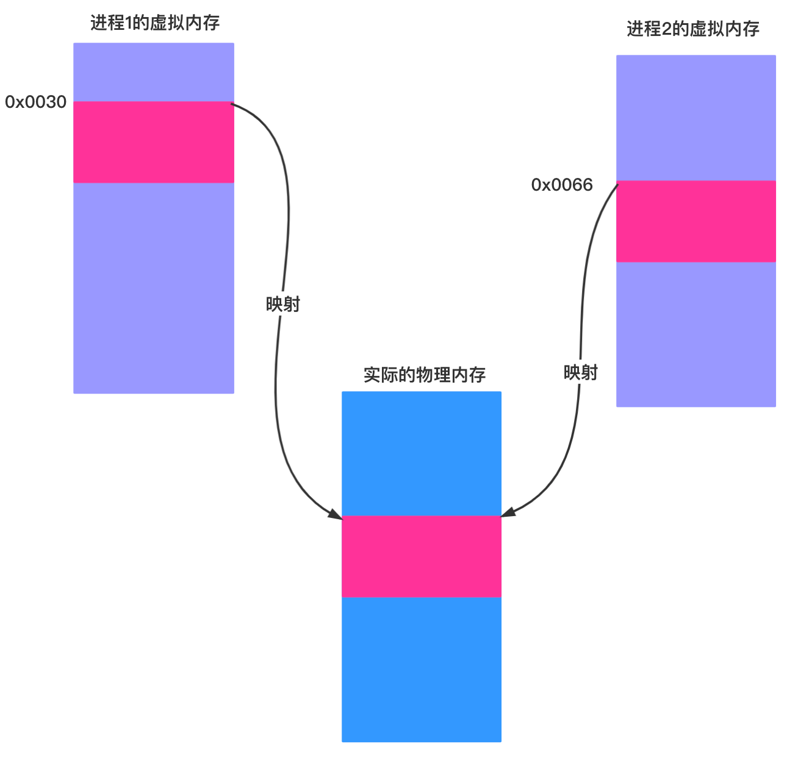
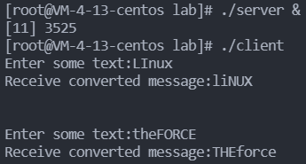
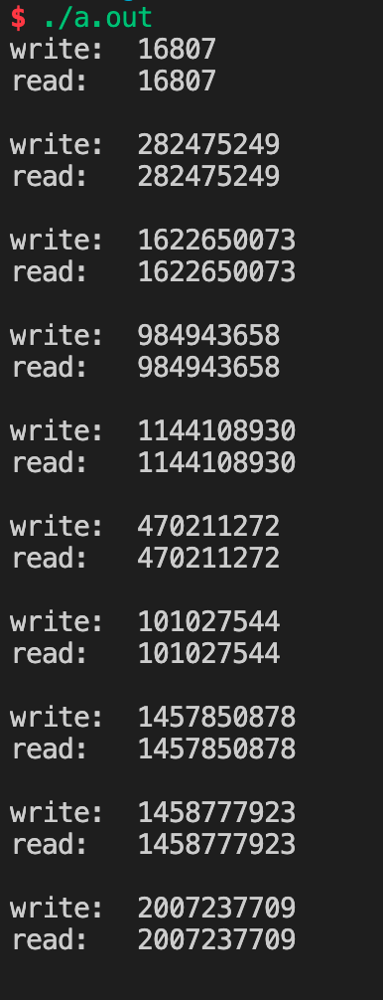

# Lab07: 进程间通信

[TOC]

## 一、实验目的

通过实验掌握管道、信号量、共享内存、消息队列四个进程间通信的机制。

## 二、实验内容

* 匿名管道
* 信号量
* 共享内存
* 消息队列

## 三、实验指南

### 进程间通信

这部分内容介绍的是操作系统内部的进程间的通信（Inter-Process Communication，IPC），主要包含管道通信、SystemV IPC（消息队列、信号量、共享内存等），不包含socket连接等系统之间的进程间的通信。

关于这部分具体的编程方法详见《Linux编程基础》第7章的内容。

#### 管道

管道是最基本的进程通信机制，可以想象成一个管道，两端分别连着2个进程，一个进程往里面写，一个进程从里面读。如果读或写管道的时候没有内容可供读或写，进程将被阻塞，直到有内容可供读写为止。
管道分为匿名管道和命名管道。 匿名管道创建后本质上是2个文件描述符，父子进程分别持有就能够使用管道，需要注意的是不能够共用匿名管道，也就是除了使用的进程，其他进程需要关闭文件描述符，保证管道 的2个描述符分别同时只有1个进程持有。
命名管道是根据路径来使用管道， 故能够在任意进程间通信。（仅要求掌握匿名管道，命名管道作为了解）

#### 消息队列

消息队列本质上在内核空间中开辟了一块内存空间，这块内存是其他进程可以访问到的，在其中使用链表的方式实现了一个队列，进程可以向该队列中发送数据块或读取数据块，从而达到进程间通信的目的。其中每个数据块包含两部分，首先是一个类型为long的type，然后是具体的数据，其中的这个type就可以作为进程之间相互约定好的协议，即你发送type为`15131049`的消息，我接收type为`15131049`的消息，我确认这就是你发出来的，我信任该数据块中的数据。 

#### 信号量

信号量这个概念非常非常重要，大家以后会经常和它打交道。信号量（**semaphore**）跟前面说的“信号”（**signal**）没啥关系，大家在理解上千万不要搞混。信号量最好理解为“信号灯”，就相当于红绿灯🚦一样，用来在进程遭遇“岔路口”的时候，通知进程做怎样的工作。其本质是为了实现多个进程之间的同步。

我们设想一下下面的场景。回想做基物实验的时候，大家需要“竞争预约”实验设备，其有这样几个特征：

- 实验设备是有限的，并且绝大多数情况下少于需要做实验的学生数量（系统中某一项资源是有限的，并且可用数量可能少于需要使用它的进程数量）
- 实验设备是“互斥的”，即实验设备是会被一个同学独占的，实验设备一旦被获取，在实验做完之前是不能被其他同学使用的——你好不容易调好了分光仪，肯定不想让其他人抢占不是？（系统中的资源是互斥的，一个进程在获取该资源之后、在释放该资源之前，是不允许其他进程使用该资源的，否则会引起错误）。

基于以上的几个特征，我们使用如下的步骤来协调大家做实验的情况：

- 每个人在做实验之前，先到选课网站上把该实验设备的可用数量`-1`
- 如果`-1`操作完成之后，实验设备数量`>=0`，那么正常开始实验；
- 如果`-1`操作完成之后，实验设备数量`<0`，那么表明，在进行`-1`操作之前，实验设备可用数量就已经`<=0`了；并且，**此时实验设备数量的绝对值表示当前有多少同学正在等待使用该实验设备**，那么我将==等待==，有人做完实验归还设备，系统也将把我放到一个==等待队列==中；
- 如果我成功抢到了实验设备并完成了实验，在实验结束后，我将归还实验设备，并将实验设备的可用数量`+1`;
- 一旦有人做完了实验并归还了实验设备，系统就会从==等待队列==中选择一名同学，让其==停止等待==，开始实验。

进程对资源的竞争使用和上述学生对实验设备的竞争基本相同。信号量就是用来标明现在还有多少实验设备可用的数据结构。（注意，**信号量要说明的是可用资源的数量，信号量本身不是资源的一部分，一种资源的使用对应一个信号量**）。

对信号量的操作分为两种，一种是`P操作`，即对信号量`-1`，就是进程要使用资源之前声明“自己将占有一份资源”；还有一种是`V操作`，即对信号量`+1`，就是进程在使用完资源后归还时声明“我完成了”。

##### 二值信号量

如果资源只有一份，那么信号量的初始值将是`1`，**最多只能有一个进程使用该资源**。这种信号量被称为“二值信号量”。这时信号量的作用就失去了指示“当前还有多少资源可用”的意义，仅仅用来标明“当前资源是否可用”，就蜕化成了“互斥锁”的作用（当然，二值信号量与互斥锁有本质的不同），其作用就类似于大家在Java中学到的`synchronized`（当然，`synchronized`要实现的是线程之间的同步）。

#### 共享内存

共享内存这个概念很重要，是大家找工作面试的常客（因为其中涉及到虚拟内存、进程通信等知识）。共享内存的本质就是把两个或多个进程的虚拟地址映射到同一块物理内存。这样，一个进程通过对这块内存的读写就能被其他进程访问到，从而实现进程间通信的功能。

#### 补充内容

- 可以使用`ipcs`查看当前系统中创建的消息队列、信号量和共享内存，以及其使用情况：[ipcs 查询进程间通信状态](https://linuxtools-rst.readthedocs.io/zh_CN/latest/tool/ipcs.html)。
- 在本节提到的这些函数的使用中，如果发生错误，将返回`-1`，但这么一个干巴巴的值很难明确告诉我们到底发生了什么错误。幸运的是，在这些系统调用发生错误的时候，系统会设置`errno`的值，我们只需要查看`errno`的值就能明白具体发生了什么错误。具体请参见：[linux系统编程之错误处理：perror,strerror和errno](https://www.cnblogs.com/mickole/p/3181097.html)。

## 四、实验习题

1. 请实现这样一个程序：客户端进程（Client）和服务器进程（Server）通过消息队列进行通信，消息队列共有两个，Up 和 Down，如下图所示：

   

   客户端进程接受用户从终端的输入，并通过Up消息队列将消息传递给服务器进程，然后等待服务器进程从Down消息队列传回消息。服务器进程从Up接收到消息后将大小写字母转换，并通过Down传回给客户端进程，客户端随后输出转换后的消息。（例如：客户端通过Up发送'linuX', 将从Down接收到'LINUx'）。多个客户端同时使用Up和Down消息队列时也应该能够正常工作，因此需要使用消息类型mtype区分来自不同客户端的消息。要求程序输出如下的效果：

   

   

2. 请实现这样一个程序：一个进程创建3个子进程，每个子进程都打印你的学号，但要求每个进程都打印完这一位数字后，才能有进程开始下一位数字的打印。例如，我的学号是`18373455`，那么输出结果应该是`111888333777333444555555`。仅允许使用信号量作为同步工具。

   

3. 在《Linux编程基础》一书对共享内存的讲解中，其给出的例子是一个进程向共享内存写，然后终止，然后再启动一个进程从共享内存中读。请实现这样一个程序：同时使用**信号量**和**共享内存**实现一个这样的功能，同时运行两个进程，一个进程向共享内存中写入数据后阻塞，等待另一个进程读，再写，然后再读。要求程序输出如下的效果：

   

   一共要求输出10组，30行，`read`行之后有一空行，以便于明显区分组别；`write`和`read`后面的数字请不要显示明显的规律性，请使用`rand()`函数获取，并一定在调用`rand()`函数之前，使用`srand(unsigned int seed)`重置随机种子，其中，`seed`为你的学号。

