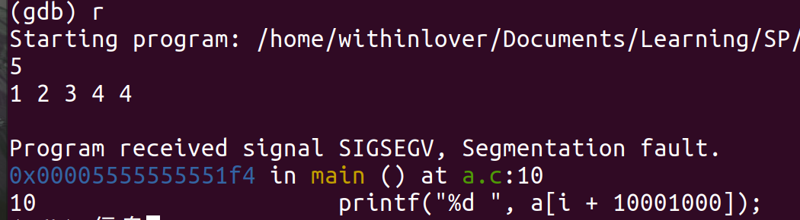
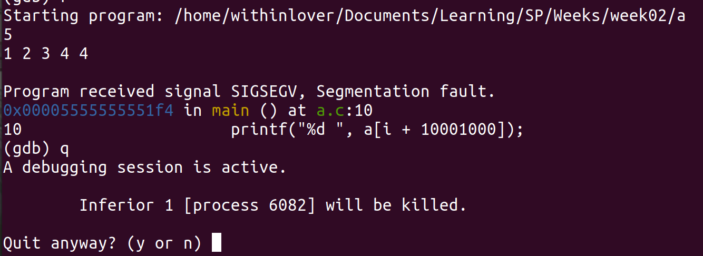

# Week02 Assignment 参考答案

## 1. 你安装好了 GCC、GDB、Make 工具了吗？记录安装命令

我的系统是：CentOS 7.6

安装命令：

```shell
yum -y install gcc
yum -y install gdb
```

我的系统是：Ubuntu 20.04

安装命令：

```shell
sudo apt-get install gcc
sudo apt-get install gdb
sudo apt-get install make

# sudo apt-get install build-essential
```

## 2. 简述 GCC、GDB、Make 工具的作用

- GCC：原 GNU C 语言编译器，后扩展为支持更多编程语言，作为编译器，它能够预处理、编译、连接和汇编 C/C++ 语言，生成系统的可执行文件
- GDB：调试 C/C++ 程序，可执行程序的启动、断点处停顿、查看过程的变量状态
- Make：控制可执行文件和其它一些从源代码来的非源码文件版本的软件，主要是读入 Makefile 的文件，通过执行这个文件中的指令，来构建多个程序的依赖关系，从而编译和安装这个程序

一些使用方法：

### GCC

- 最简单的使用：`gcc a.cpp`
- `-o name`：将生成的目标文件命名为 name
- `-g`：生成便于 GDB 调试的信息，如果需要使用 GDB 则需要开启
- `-D name`：用于 DEBUG，便于输出额外信息（实际上不如直接用 GDB ？）
- `-E`：从 .c 生成 .i（头文件展开，去掉注释，宏替换）
- `-S`：从 .i 生成 .s（C 文件变为汇编文件）

- `-c`：从 .s 生成 .o（汇编文件变为二进制文件）
- `-Wall`：生成所有的警告信息
- `-Werror`：将警告信息视为错误
- `-O,-O2,-O3`：由编译器优化生成的可执行文件

### GDB

#### 启动

在终端输入 `gdb` 启动 GDB

```shell
gdb
```

在 GDB 中，通过 `file` 指令制定需要被调试的程序

```shell
(gdb) file test
```

#### 运行

使用 `run` 指令运行被调试的程序，可以简化为 `r`

```shell
(gdb) run
```

当程序出现故障时，GDB 会提供相关的错误信息



定位到错误后，就可以利用 GDB 对程序进行调试了

#### 退出

使用 `quit` 退出，可简化为 `q`

如果程序正常结束，则 `q` 指令会成功退出 GDB，否则会收到如下提示：



输入 `y` 可以强制杀死被调试的程序然后退出

#### 断点

使用 `break` 设置断点，可简化为 `b`，后面跟一个行号或者函数名，之后程序在执行到这里时会中断。

- 设置行号

```shell
(gdb) b 7
Breakpoint 1 at 0x118d: file a.c, line 7.
```

- 设置函数名

```shell
(gdb) b main
Breakpoint 2 at 0x1169: file a.c, line 5.
```

另外，break 命令后面也可以在断点位置后面跟一个条件，仅当该条件为真的时候中断

```shell
(gdb) b 9 if n == 5
Breakpoint 3 at 0x11d0: file a.c, line 9.
```

#### 控制

使用 `continue` 命令使中断的程序继续运行，可简写为 `c`

（这里只能让通过断点中断的程序继续运行，而非 运行时错误 的程序）

使用 `step` 使中断的程序执行一行，可简写为 `s` ，如果有函数调用则会进入函数，并在函数第一行中断

使用 `next` 使中断的程序执行一行，可简写为 `n`， 如果有函数调用，程序将不跟踪进入函数，而是直接在下一行中断

#### 监视

使用 `print` 命令输出一个表达式的值，可简写为 `p`，这里的表达式也可以为包含了多个函数调用的复杂表达式

使用 `display` 来持续监视某个表达式的值，可简写为 `disp`

#### 查看代码

使用 `list` 来查看部分代码，可简写为 `l` 。后面跟一个行号

### Make

- 使用 make 前需要编写 makefile，后者用于告诉前者如何调用命令来完成目标。
- makefile 由一系列规则组成，每条规则由 `<target>`, `<prerequisites>` `<command>` 组成

```makefile
<target> : <prerequisites>
[tab]  <commands>
```

目标是必须的，前置条件和命令必须至少存在一个

## 3. 尝试练习使用 GDB 命令

- 任意编写一个 C 程序，通过截图等方式，说明你在调试过程中的一些尝试

调试的程序如下：

```c
#include <stdio.h>

void swap(int *x, int *y) {
	int temp = *y;
	*y = *x;
	*x = temp;
	return ;
}

int a[10010], n;

int main() {
	scanf("%d", &n);
	for (int i = 1;i <= n; ++i)
		scanf("%d", &a[i]);
	for (int i = 1;i <= n; ++i)
		for(int j = 1;j <= n - i; ++j)
			if(a[j] < a[j + 1])
				swap(&a[i], &a[j + 1]);
	for (int i = 1;i <= n; ++i)
		printf("%d ", a[i]);
	printf("\n");
	return 0;
}
```

这段代码实现了一个错误的冒泡排序算法，希望实现的是从大到小排序。现在尝试用 GDB 将其错误找出来

首先编译并进入 GDB 环境

```shell
gcc a.c -g -o a
gdb a
```

在没有任何修改的前提下，运行代码

```shell
(gdb) r
Starting program: /home/withinlover/Documents/Code/c/a
5
5 3 2 1 4
4 3 2 1 5
[Inferior 1 (process 9948) exited normally]
```

发现代码可以正常运行，所以很有可能是冒泡部分的逻辑出现了问题。

查看代码

```shell
(gdb) l 5
1	#include <stdio.h>
2
3	void swap(int *x, int *y) {
4		int temp = *y;
5		*y = *x;
6		*x = temp;
7		return ;
8	}
9
10	int a[10010], n;
(gdb) l
11
12	int main() {
13		scanf("%d", &n);
14		for (int i = 1;i <= n; ++i)
15			scanf("%d", &a[i]);
16		for (int i = 1;i <= n; ++i)
17			for(int j = 1;j <= n - i; ++j)
18				if(a[j] < a[j + 1])
19					swap(&a[i], &a[j + 1]);
20		for (int i = 1;i <= n; ++i)
```

按照冒泡排序的思路，如果输入的是 `5 3 2 1 4` ，那么在第一轮的冒泡中，应该仅交换了 `1 4` 的位置

因此，对 `swap()` 设置断点，以检查第一轮冒泡的正确性

```shell
(gdb) b swap
Breakpoint 1 at 0x555555555189: file a.c, line 3.
```

再次运行代码，输入保持不变

```shell
(gdb) r
Starting program: /home/withinlover/Documents/Code/c/a
5
5 3 2 1 4

Breakpoint 1, swap (x=0x55555555537d <__libc_csu_init+77>, y=0x7ffff7fd15e0)
    at a.c:3
3	void swap(int *x, int *y) {
(gdb)
```

此时程序终止，理论上我们此时进行交换的应该是 1 和 4。输出查看一下：

```shell
(gdb) p *x
$1 = 29590344
```

这个数字显然出现了异常，不过实际上是由于程序尚未将参数传进函数所致，我们先单步运行一次

```shell
(gdb) n
4		int temp = *y;
(gdb) p *x
$2 = 5
(gdb) p *y
$3 = 4
```

此时我们发现，传进来的并非 1 和 4，也就是说 `*x` 的传值是有问题的，查看对应的代码区域

```shell
(gdb) l 20
15			scanf("%d", &a[i]);
16		for (int i = 1;i <= n; ++i)
17			for(int j = 1;j <= n - i; ++j)
18				if(a[j] < a[j + 1])
19					swap(&a[i], &a[j + 1]);
20		for (int i = 1;i <= n; ++i)
21			printf("%d ", a[i]);
22		printf("\n");
23		return 0;
24	}
```

重点关注 19 行 swap 的第一个参数，不难发现在此处 i 和 j 写反导致出错，退出修改

```shell
(gdb) q
A debugging session is active.

	Inferior 1 [process 10709] will be killed.

Quit anyway? (y or n) y
```

修改完成后重新编译，测试

```shell
(gdb) r
Starting program: /home/withinlover/Documents/Code/c/a
5
5 3 2 1 4
5 4 3 2 1
[Inferior 1 (process 10866) exited normally]
```

程序已经恢复正常，bug--

## 4. 请阐述静态链接库和动态链接库的异同点

- 静态链接库：当要使用时，连接器会找出程序所需的函数，然后将它们拷贝到执行文件，由于这种拷贝是完整的，所以一旦连接成功，静态程序库也就不再需要了。

- 动态库而言：某个程序在运行中要调用某个动态链接库函数的时候，操作系统首先会查看所有正在运行的程序，看在内存里是否已有此库函数的拷贝了。如果有，则让其共享那一个拷贝；只有没有才链接载入。

## 5. 请阐述 Make 命令工具如何确定哪些文件需要重新生成，而哪些不需要生成

- 一是通过输入的指令，比如 make test，则会根据 test 的依赖关系进行迭代生成
- 二是当发现待生成的文件已经存在时，会判断其依赖项是否发生了更新，如果没有更新则不再重复生成

## 6. 请简述 Make 中的伪目标的作用是什么

除了文件名，目标还可以是某个操作的名字，这称为"伪目标"（phony target），比如：

```makefile
clean:
      rm *.o
```

这段规则并不是为了生成文件，而是为了清理多余的 `*.o` 文件

但是，如果当前目录下恰好有一个名为 `clean` 的文件，在输入 `make clean` 时，便不会完成清理工作

为了避免这种情况，可以明确声明 `clean` 伪目标

```shell
.PHONY: clean
clean:
        rm *.o
```
