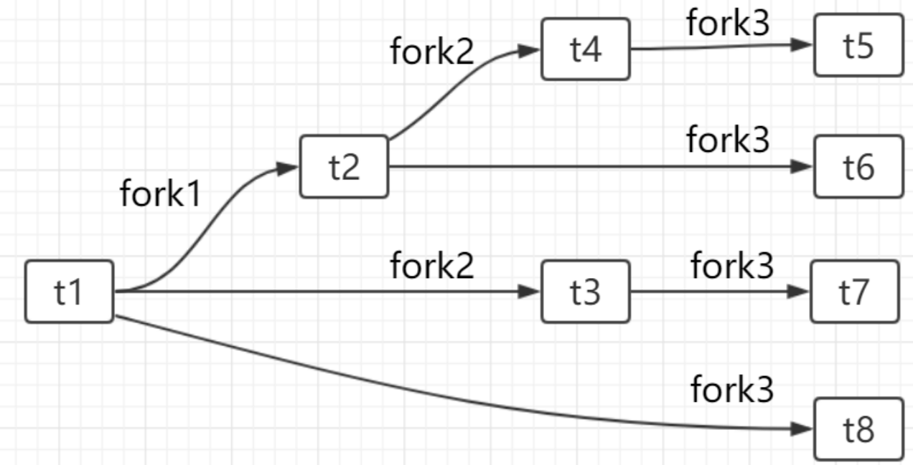

# Week09 Assignment 参考答案

## 1. 请给出下列代码输出行数，并解释原因

```c
#include<stdio.h>
#include<unistd.h>
int main(){
    printf("my pid is %d\n", getpid());
    fork();
    fork();
    fork();
    printf("my pid is %d\n", getpid());
}
```

输出 9 行，主进程在 `fork()` 前输出 1 行，`fork()` 三次得到八个进程，执行程序最后一行输出 8 行，共 9 行

## 2. 画出上述进程的创建过程



## 3. 编写一个程序，实现下图示的进程之间的关系

进程 A -> 进程 B -> 进程 C

其中箭头的方向表明它们之间的生成关系，即 A 是祖先进程，C 是孙子进程。

秦喆答案：

```c
#include <stdio.h>
#include <stdlib.h>
#include <sys/types.h>
#include <unistd.h>
int main(void) {
  pid_t pid;
  pid = fork();
  if (pid < 0) {
    perror("fork failed");
    exit(1);
  }
  if (pid == 0) {
    printf("This is the son B\n");
    pid_t p = fork();
    if (p == 0) {
      printf("This is the grandson C\n");
    }
  } else {
    printf("This is the parent A\n");
  }
  return 0;
}
```

蒋博文答案：

```c
#include <stdio.h>
#include <stdlib.h>
#include <unistd.h>
int main() {
  printf("this is parent A,pid=%d\n", getpid());
  if (fork() == 0) {
    printf("this is child B,pid=%d\n", getpid());
    if (fork() == 0) {
      printf("this is grandchild C,pid=%d\n", getpid());
    }
  }
  return 0;
}
```

## 4. 编写一个程序，创建两个子进程，父进程在屏幕上输出 10 个字符 'A'，两个子进程分别输出 10 个 'B' 和 'C'

> 要求父进程在两个子进程输出完字符后再输出自己的字符。

秦喆答案：

```c
#include <stdio.h>
#include <stdlib.h>
#include <sys/types.h>
#include <unistd.h>
int main(void) {
  pid_t pid;
  pid = fork();
  if (pid < 0) {
    perror("fork failed");
    exit(1);
  }
  if (pid == 0) {
    printf("BBBBBBBBBB");
  } else {
    pid_t p = fork();
    if (p == 0)
      printf("CCCCCCCCCC");
    else {
      sleep(2);
      printf("AAAAAAAAAA");
    }
  }
  return 0;
}
```

蒋博文答案：

```c
#include <stdio.h>
#include <stdlib.h>
#include <unistd.h>
int main() {
  int i = 2;
  char c = 'A';
  while (i--) {
    if (fork() == 0) {
      int j;
      printf("this is the %dst child,pid=%d\n", 2 - i, getpid());
      for (j = 0; j < 10; j++) {
        printf("%c", c + 2 - i);
      }
      printf("\n");
      exit(1);
    }
  }
  sleep(1);
  int j;
  printf("this is the parent,pid=%d\n", getpid());
  for (j = 0; j < 10; j++) {
    printf("%c", c);
  }
  return 0;
}
```
