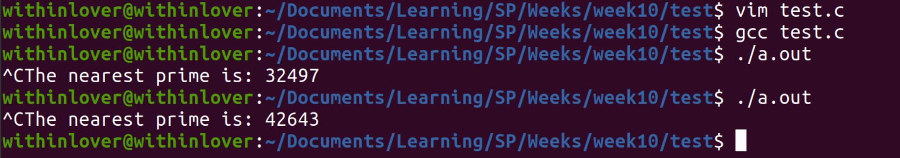
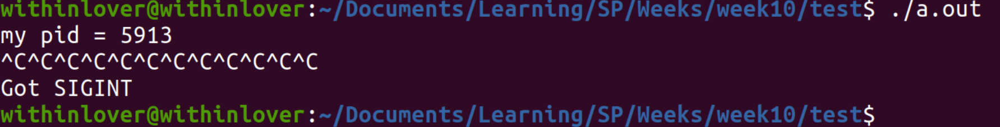
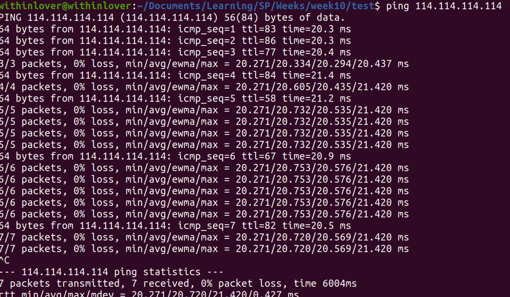
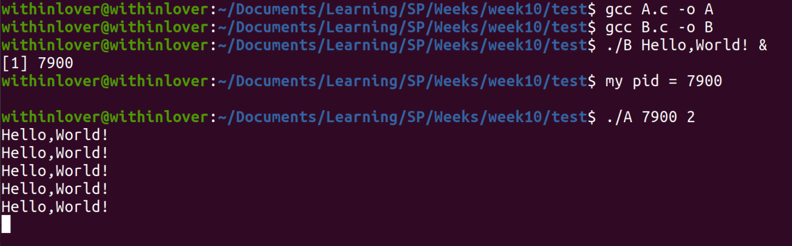

# Week10 Assignment 参考答案

感谢郝泽钰同学！

## 1. 编写一个程序，实现这样的功能：搜索 2~65535 之间所有的素数并保存到数组中，用户输入^C 信号时，程序打印出最近找到的素数

```c
#include <signal.h>
#include <stdbool.h>
#include <stdio.h>
#include <sys/types.h>
#include <unistd.h>
int isPrime(int n) {
  for (int i = 2; i < n; ++i)
    if (n % i == 0) return false;
  return true;
}
int prime[65536], pcnt;
void sigHandler(int signalNum) {
  printf("The nearest prime is: %d\n", prime[pcnt]);
}
int main() {
  signal(SIGINT, sigHandler);
  for (int i = 1; i <= 65536; ++i)
    if (isPrime(i)) prime[++pcnt] = i;
  return 0;
}
```



## 2. 简述什么是可靠信号和不可靠信号，并实验 SIGINT 信号是可靠的还是不可靠的

- 可靠信号：同时有多个信号时，可能有信号的丢失
- 不可靠信号：克服了信号丢失的问题（利⽤队列机制）

SIGINT 信号不可靠。



对于多次输⼊的 SIGINT 信号，只对其中⼀个作出了反应。

```c
#include <signal.h>
#include <stdio.h>
#include <string.h>
#include <unistd.h>
void sig_Handler(int, siginfo_t*, void*);
int main() {
  struct sigaction act;
  sigset_t newmask, oldmask;
  int rc;
  sigemptyset(&newmask);
  sigaddset(&newmask, SIGINT);
  sigaddset(&newmask, SIGRTMIN);
  sigprocmask(SIG_BLOCK, &newmask, &oldmask);
  act.sa_sigaction = sig_Handler;
  act.sa_flags = SA_SIGINFO;
  if (sigaction(SIGINT, &act, NULL) < 0) {
    printf("install sigalerror\n");
  }
  if (sigaction(SIGRTMIN, &act, NULL) < 0) {
    printf("install sigalerror\n");
  }
  printf("my pid = %d\n", getpid());
  sleep(10);
  sigprocmask(SIG_SETMASK, &oldmask, NULL);
  return 0;
}
void sig_Handler(int signum, siginfo_t* info, void* mask) {
  if (signum == SIGINT) printf("Got SIGINT\n");
  if (signum == SIGRTMIN) printf("Got SIGRTMIN\n");
}
```

## 3. 在执行 `ping http://www.people.com.cn` 时，假设该网站是可 ping 通的，但是在输入^\时，ping 命令并没有结束而是显示 ping 的成功率，但是输入^C 时，ping 程序却被退出，请解释发生这一现象的原因



推测原因是 ping 命令实现过程中重写了对于 ^\ ^C 信号的处理

## 4. 编写程序实现如下功能：程序 A.c 按照用户输入的参数定时向程序 B.c 发送信号，B.c 程序接收到该信号后，打印输出一条消息

运行过程如下：

```sh
./B value& # 此时，输出进程 B 的 PID 号，value 表示要输出的参数。
./A processBPID timerVal # 第一个参数表示进程 B 的 PID，第二个参数为定时时间。
```

效果如下图：



```c
// A.c
#include <signal.h>
#include <stdbool.h>
#include <stdio.h>
#include <string.h>
#include <unistd.h>
int main(int argc, char *argv[]) {
  int pid;
  sscanf(argv[1], "%d", &pid);
  int time;
  sscanf(argv[2], "%d", &time);
  while (true) {
    kill(pid, 2);
    sleep(time);
  }
  return 0;
}

// B.c
#include <signal.h>
#include <stdbool.h>
#include <stdio.h>
#include <string.h>
#include <unistd.h>
char value[110];
void sig_Handler(int sigNum, siginfo_t *info, void *mask) {
  printf("%s\n", value);
}
int main(int argc, char *argv[]) {
  strcpy(value, argv[1]);
  struct sigaction act;
  sigset_t newmask, oldmask;
  int rc;
  sigemptyset(&newmask);
  sigaddset(&newmask, SIGINT);
  sigprocmask(SIG_BLOCK, &newmask, &oldmask);
  act.sa_sigaction = sig_Handler;
  act.sa_flags = SA_SIGINFO;
  if (sigaction(SIGINT, &act, NULL) < 0) {
    printf("install sigalerror\n");
  }
  if (sigaction(SIGRTMIN, &act, NULL) < 0) {
    printf("install sigalerror\n");
  }
  printf("my pid = %d\n", getpid());
  sigprocmask(SIG_SETMASK, &oldmask, NULL);
  while (true) {
    sleep(1);
  }
  return 0;
}
```
