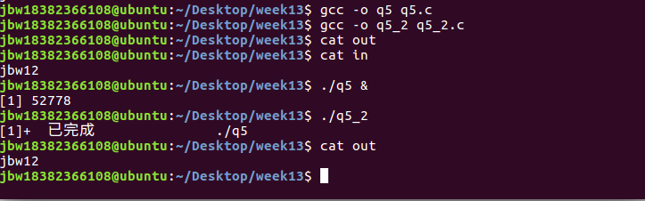

# Week13 Assignment 参考答案

## 1. 简述信号量的作用，如何利用信号量实现同步和互斥？

- 作用：信号量是用来解决进程间的同步与互斥问题的一种进程间通信机制，包括一个称为信号量的变量和在该信号量下等待资源的进程等待队列，以及对信号量进行的两个原子操作（P/V 操作）。
- 同步：由一个无条件执行的进程开始，信号量资源初始值为 0，进程结束时 V(S)操作，信号量资源+1，此时
  通知别的进程。需要该资源的进程，打破阻塞，P(S)操作，去访问临界资源。
- 互斥：P(S)操作，资源-1，则其余进程不可再访问该临界资源。V(S)操作结束后，资源+1，此时别的进程才可
  进行是否可以访问判断。

## 2. 简述共享内存的作用和用法，共享内存为什么需要与信号量一起使用？

- 作用：省去当进程向队列/管道写⼊数据时和读取消息时数据从用户地址向内核地址空间复制的操作
- 用法：
  - 创建：从内存中获得一段共享内存区域 shmget()
  - 映射：shmat()
  - 撤销映射：shmdt()
- 与信号量一起使用：保证某块共享内存在被其他进程进行读或写时不会被其他进程的操作干扰，需要信号量来加上对应的锁

## 3. 简述消息队列的作用和用法，并将其与管道进行异同点对比

- 作用：将消息看作一个记录并按相应的优先级和格式以一个链表的形式存储起来
- 用法：
  - 创建消息队列：msgsnd()
  - 发送数据到消息队列：msgsnd()
  - 从消息队列读取：msgrcv()
  - 删除队列
- 与管道的对比：消息队列更灵活，提供有格式字节流，有利于减少开发⼈员工作量，其次，消息具有类型，在实际应用中，可为不同类型的消息分配不同的优先级

## 4. 请查阅资料简述进程间通信的 System V、POSIX 两种标准之间的差异性

| 指标                  | System V                                                                                                      | POSIX                                                                       |
| --------------------- | ------------------------------------------------------------------------------------------------------------- | --------------------------------------------------------------------------- |
| 效率性能              | PSYSTEM V 在同步互斥手段方面的无竞争条件下是无论何时都会陷⼊内核，性能稍低                                    | POSIX 在在同步互斥手段方面的无竞争条件下是不会陷⼊内核，性能较⾼            |
| 冗余可靠性            | System V 提供了 SEM_UNDO 选项可以解决成功获取信号量后，进程如果意外终止，将无法-释放-信号量个问题，可靠性高。 | sem_wait 函数成功获取信号量后，进程如果意外终⽌，将无法释放信号量，可靠性差 |
| 操作系统              | System V 操作系统实现相当⼴泛                                                                                 | 可能有小部分操作系统没有实现 POSIX 标准                                     |
| 移植性                | 不同操作系统 System V 存在一些差异                                                                            | 可移植性                                                                    |
| 进程间&线程间通信同步 | 进程间通信，线程间使用较少。线程相对于进程是轻量级的。每次调用都会陷⼊内核的接口，会丧失线程的轻量优势        | 优                                                                          |

## 5. 请编写一个管道通信程序实现文件的传输，并请思考采用其他进程通信方式是否可方便实现进程间的文件传输

黄泽桓答案：

```c
#include <unistd.h>
#include <stdlib.h>
#include <fcntl.h>
#include <limits.h>
#include <sys/types.h>
#include <sys/stat.h>
#include <stdio.h>
#include <string.h>
int main()
{
    int pid;
    int fd;
    int fd1;
    int fd2;
    mkfifo("./pipe", 0777);
    pid = fork();
    if(pid > 0)
    {
        fd = open("./test.txt", O_RDONLY);
        fd1=open("./pipe",O_WRONLY);
        char buf[200];
        read(fd, buf, 1024);
        write(fd1,buf,strlen(buf)+1);
        close(fd);
        close(fd1);
    }
    else if(pid == 0)
    {
        fd = open("./pipe", O_RDONLY);
        FILE *f=fopen("./copy.txt","w");
        fclose(f);
        char buf2[200];
        fd2=open("./copy.txt",O_WRONLY);
        read(fd, buf2, 1024);
        write(fd2,buf2,strlen(buf2));
        close(fd);
        close(fd2);
    }
    return 0;
}
```

使⽤共享内存可以不新建一个临时文件存储数据，而是可以直接对共享内存读取。

蒋博文答案：

```c
//q5.c
#include <unistd.h>
#include <sys/types.h>
#include <sys/stat.h>
#include <fcntl.h>
#include <stdlib.h>
#include <stdio.h>
#include <string.h>

int main(){
    char buf[100];
    int fd=open("in", O_RDONLY);
    int fd1=open("guandao",O_WRONLY);//命名管道
    while(read(fd,buf,1)>0)
        write(fd1,buf,1);
    close(fd);close(fd1);
}

//q5_2.c
#include <unistd.h>
#include <sys/types.h>
#include <sys/stat.h>
#include <fcntl.h>
#include <stdlib.h>
#include <stdio.h>
#include <string.h>

int main(){
    char buf[100];
    int fd=open("out", O_WRONLY);
    int fd1=open("guandao",O_RDONLY);
    while(read(fd1,buf,1))
        write(fd,buf,1);
    close(fd);close(fd1);
}
```



可以通过其他进程实现数据传输，比如使用共享内存的方法，一个进程将文件里的内容放入共享内存中，另一个进程从共享内容中读取内容并输入到目标文件中。

周海涛答案：

写入管道：

```c
#include<stdio.h>
#include<stdlib.h>
#include<unistd.h>
#include<sys/stat.h>
#include<sys/types.h>
#include<errno.h>
#include<fcntl.h>

#define N 32
#define FIFOPATH "/home/oem/Desktop/Code/ripe"

int main(int argc, const char *argv[]){
    int fd_fifo,fd_src,ret;       //
    char buf[N] = {};

    if(mkfifo(FIFOPATH,0666) != 0)
        if(errno != EEXIST){
            perror("fail to mkfifo");
            return -1;
        }

    fd_src = open(argv[1],O_RDONLY);
    fd_fifo = open(FIFOPATH,O_WRONLY);

    while(1){
        ret = read(fd_src,buf,N);
        if(ret == 0)    break;
        write(fd_fifo,buf,ret);
    }
    close(fd_fifo);
    close(fd_src);
    return 0;
}
```

从管道中读取：

```c
#include<stdio.h>
#include<stdlib.h>
#include<unistd.h>
#include<sys/stat.h>
#include<sys/types.h>
#include<errno.h>
#include<fcntl.h>

#define N 32
#define FIFOPATH "/home/oem/Desktop/Code/ripe"

int main(int argc, const char *argv[]){
    int fd_fifo,fd_dest,ret;
    char buf[128];

    if(mkfifo(FIFOPATH,0666) != 0)
        if(errno != EEXIST){
            perror("fail to mkfifo");
            return -1;
        }

    fd_fifo = open(FIFOPATH, O_RDONLY);
    fd_dest = open("out.txt", O_WRONLY|O_CREAT|O_TRUNC, 0666);

    while(1){
        ret = read(fd_fifo,buf,N);
        if(ret == 0)    break;
        write(fd_dest,buf,ret);
    }
    close(fd_fifo);
    close(fd_dest);
    return 0;
}
```
